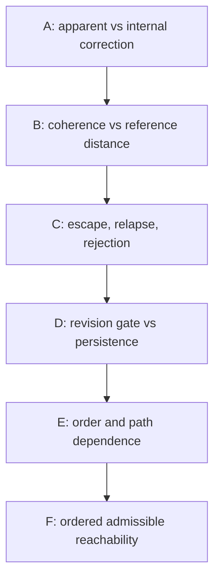

# Experiment map

This map describes how the **research question** narrowed from Exp A to Exp F. It is not a demonstrated causal sequence in real AI.

## Series overview

| Series | Primary question | Frozen size | Primary evidence |
| --- | --- | ---: | --- |
| A | Can outward correction occur without internal revision? | 27,104 factorial rows; 625 pressure-grid rows | [`a_trials.csv.gz`](../results/a_trials.csv.gz), [`a_summary.csv`](../results/a_summary.csv) |
| B | Can accepted-input coherence improve while independent-reference distance worsens? | 120 trajectories; 9,600 state rows; 13,440 input events; 720 sensitivity runs | [`b_trajectories.csv`](../results/b_trajectories.csv), [`b_input_events.csv`](../results/b_input_events.csv) |
| C | Can independent reference injection escape a self-contained attractor? | 54 runs; 10,167 state rows; 20,130 events | [`summary.csv`](../experiments/rssi_attractor_escape/results/summary.csv), [`event_log.csv.gz`](../experiments/rssi_attractor_escape/results/event_log.csv.gz) |
| D | Where does evidence strength permit revision, and does injection frequency determine persistence? | 920 runs, including 900 primary; 176,710 state rows; 346,450 events | [`phase_grid.csv`](../experiments/rssi_attractor_escape_boundary/results/phase_grid.csv), [`boundary_estimates.csv`](../experiments/rssi_attractor_escape_boundary/results/boundary_estimates.csv) |
| E | Which post-injection sequences produce recapture? | 66 conditions × 5 seeds = 330 runs; 44,435 states; 48,880 events | [`order_effects.csv`](../experiments/rssi_recapture_dynamics/results/order_effects.csv), [`path_dependence.csv`](../experiments/rssi_recapture_dynamics/results/path_dependence.csv) |
| F | Which finite ordered paths can reach the old anchor under the unchanged gate? | 34 conditions × 5 seeds = 170 runs; 22,610 states; 11,940 events | [`bridge_summary.csv`](../experiments/rssi_admissible_bridge/results/bridge_summary.csv), [`float_frontier.csv`](../experiments/rssi_admissible_bridge/results/float_frontier.csv) |

These are different designs and denominators. The repository does not compute an aggregate “RSSI success rate.” Multi-seed percentages are observed rates in this synthetic setup, not precise population probabilities.

## A — Apparent correction

Exp A manually replayed bounded pathways from pinned Hoho source excerpts. It separated output correctness from the stored internal state. Under the predefined high-pressure, initially-wrong, correct-hypothesis subset, the `external_only` arm produced 726/726 correct outputs and 0/726 internally correct final beliefs. The correct apparent response was supplied by the harness; this is not autonomous discovery or evidence of deception.

- Protocol: [`experiments/exp_a/PROTOCOL_JA.md`](../experiments/exp_a/PROTOCOL_JA.md)
- Shared runner: [`run_experiments.py`](../run_experiments.py)
- Pinned source metadata: [`results/summary.json`](../results/summary.json)

## B — Reference divergence

Exp B declared the ordinary scalar gate used later. In `drift_away`, `gated`, `tol=.05`, accepted-input coherence rose from 0.9619349672 at step 1 to 0.9999858876 at step 80, while distance to the independent reference rose from 0.6380650328 to 0.9998658149. The reference inputs were rejected. Other fixtures included a frozen state, an admissible bridge, oscillation, and all-rejected input; the result is not a claim that every trajectory diverges.

- Protocol: [`experiments/exp_b/PROTOCOL_JA.md`](../experiments/exp_b/PROTOCOL_JA.md)
- Figure: [`results/experiment_b.png`](../results/experiment_b.png)

## C — External reference injection

Exp C introduced an immutable reference harness and delivered reference-derived evidence outside the ordinary self-selection gate. Delivery did not bypass the evidence handler’s update threshold. Stored classifications were:

| Classification | Runs |
| --- | ---: |
| Persistent escape candidate | 12 |
| Relapse | 12 |
| Rejection | 18 |
| External compliance | 6 |
| No-injection stable control | 6 |

See the frozen [`protocol`](../experiments/rssi_attractor_escape/PROTOCOL.md), [`report`](../experiments/rssi_attractor_escape/EXPERIMENT_REPORT.md), and [`trajectory figure`](../experiments/rssi_attractor_escape/results/trajectories.png).

## D — Gate boundary and persistence

For first injection at (D=1), the implemented support rule `.6*S + .4*D >= .75` gives the analytic handler threshold (S\ge7/12). The finite grid bracketed it between .58 and .59. In the tested grid, `S<=.58` was rejected; `S>=.59` revised. After revision, stationary sequences persisted while descending-bridge sequences relapsed. Injection frequency changed relapse timing in one region but did not change the final classification.

Primary outcomes were 480 rejection, 210 persistent candidate, and 210 relapse. This is an implementation-specific boundary, not a universal phase-transition constant.

## E — Post-injection ordering

With strength and frequency fixed at a revision-producing setting, Exp E varied post-input sequences. Its 330 runs produced 300 persistent candidates and 30 relapses. A 120-value bridge multiset relapsed in descending order but remained persistent in ascending and fixed-seed shuffled orders. A separate 60R/60O multiset did **not** change classification across the tested orders, providing a negative control against “order always matters.”

Fast and slow paths ending with the same offered value 0 also produced different final beliefs in all five paired seeds. This is path dependence through the current scalar state, not proof of a hidden memory variable or mathematical hysteresis.

## F — Admissible bridge geometry

Exp F made ordered reachability explicit. It separated exact target hitting, the existing relapse classification, bridge completion, and static graph connectivity.

Key contrasts:

- 120 direct zero inputs: all rejected; final belief 1.
- 21-step Binary64 frontier bridge: all accepted; exact final belief 0.
- Same 120-value multiset: descending and alternating orders reached 0; ascending and fixed-seed shuffled orders did not.
- Removing a point from a monotone bridge blocked it when the new gap exceeded tolerance, but not when the remaining gap stayed admissible.
- A connected static value graph did not guarantee target reachability under every fixed presentation order.

Exp F stored 83 persistent candidates, 82 relapses, and 5 mixed/partial escapes. Those outcome counts use the unchanged C–E classification; exact target reaching is reported separately.

## Validation history

The completed series stored successful validation and fixed-seed reproduction logs before publication: 12 checks for A/B, 12 groups for C, 10 for D, 11 for E, and 11 for F, with downstream regression of earlier series. This public snapshot removes machine-specific absolute paths and private Ideal-layer material. [`scripts/reproduce.py`](../scripts/reproduce.py) reruns the unchanged generators portably and compares CSV bytes with the frozen results.

See [`results/frozen/VALIDATION_HISTORY.json`](../results/frozen/VALIDATION_HISTORY.json) and [`docs/PUBLICATION_AUDIT.md`](PUBLICATION_AUDIT.md).

