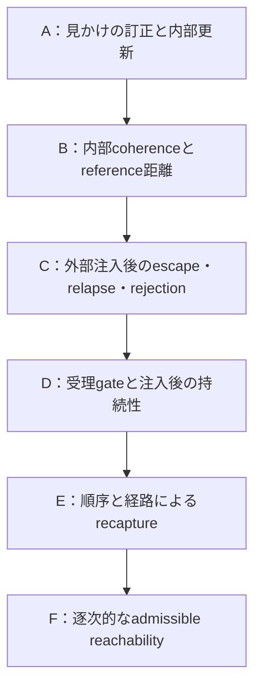

# RSSI Experiment Map A–F

固定日：2026-09-18。以下は**問いの進展**です。全矢印を一つの実験で介入同定した因果連鎖でも、実世界AI一般の発達過程でもありません。

apparent improvement → reference divergence → escape → recapture → path dependence → reachability、という研究上の絞り込みです。Fの数学だけでAのExternalComplianceを説明したと見なすこともありません。

## 各段階で固定するもの

| Series | 中心問い | 固定された知見 | 残る制約 |
| --- | --- | --- | --- |
| A | apparent correction ≠ internal revision | 出力訂正と内部state更新は分離できる | 正答出力はharnessが供給。Python source replay |
| B | C↑ ⇒ D↓か | C上昇とD増大の対照例がある | Bのgateは明示したsynthetic rule |
| C | 独立reference注入で脱出できるか | 同じ枠組み内でescape / relapse / rejection / compliance | 配送bypassと更新承認は別 |
| D | SとFはどこを変えるか | 初回受理境界とpost-input regimeによる最終分類を分離 | 一つのS×F平面を3相が順に通過する構造ではない |
| E | post-inputの何がrecaptureを決めるか | 同一multisetの順序差、同一終値の経路差 | qだけ・終値だけの説明は不十分 |
| F | どの有限pathが到達可能か | 逐次gate、bridge gap、順序、binary64最短を分離 | 静的連結性は任意の提示順序の保証ではない |

## 規模と分母

| Series | 保存された規模 | state行 | input event行 |
| --- | --- | ---: | ---: |
| A | 27,104 factorial trial、pressure grid 625行 | 非時系列trial | 非時系列trial |
| B | 120 trajectory、別途seed感度720 run | 9,600 | 13,440 |
| C | 54 run | 10,167 | 20,130 |
| D | 920 run | 176,710 | 346,450 |
| E | 330 run | 44,435 | 48,880 |
| F | 170 run | 22,610 | 11,940 |

Dは900 primary run＋20 control、180 regime別grid cellです。Eは66条件×5seed、Fは34条件×5seedです。Bの120 trajectoryと720感度run、Aのfactorial trialは同じ母集団ではありません。合算した「RSSI成功率」を作りません。割合は observed rate in this synthetic setup であり、精密な母集団確率の推定ではありません。state行には初期／注入状態も含まれ、clock step数と同じではありません。

## C〜Fで変更しない定義

| 対象 | 既存定義と解釈 |
| --- | --- |
| 通常gate | known scalarでabs(x−b)≤.05ならb←x、それ以外はbを維持。gateにepsilonを加えない |
| 外部注入 | referenceを通常gateの外から配送。evidence handlerはsupport=.6S+.4D_before≥.75ならcandidate=1を代入する。Sによる補間更新ではない |
| D | 固定R0=1への距離abs(b−1)。self-selected inputの集合からreferenceを再選択しない |
| C | 各stepで受理した通常入力の1−abs(x−b_before)の平均。受理ゼロはNA。nativeのcoherenceとは別 |
| Attractor | W=max(10,2×period)の末尾安定性、belief/state_deltaのEPS=1e-12による判定、D≥.5、referenceとの隔たり≥.2、位相端点を確認し、clippedな±tol/4・±tol/2の有限probeが一周期で戻ることを確認 |
| Attractorの射程 | stationaryは11 baseline step、descending_bridgeは120。単なる固定step経過ではないが、任意摂動への大域的吸引性証明でもない |
| Qualifying revision | 注入でDが少なくとも.1改善すること。単なるrevisionフラグと別 |
| Relapse | 通常step終端が旧anchorの.05近傍にあり、D≥D_pre−.05となる状態が5連続。既存EPSを分類比較に用いる。onsetは最初のstep、confirmationは4step後 |
| Persistent candidate | qualifying revisionがあり、最後のqualifying revision後にRelapseせず、末尾100通常stepを通じD≤D_pre−.1を満たす。既存EPSを保持 |
| D_post / D_final | D_postは末尾20step平均。D_finalや注入直後Dとは別 |
| F exact target | b==0。Relapseの近傍・持続windowと別。bridge completionは全入力受理、末尾入力0、最終b=0を要求 |

stationaryは毎step `[0,1]`、descending_bridgeは周期40の下降値と0からなる既存列です。Fでは有限path後を空入力で120clock stepまで保持し、0を追記しません。完全な判定順序・境界比較は[C runner](../../experiments/rssi_attractor_escape/run_experiment.py)と各protocolを正とし、この文書による分類の再計算・変更は行っていません。

## A/Bの証拠入口

- [A protocol](../../experiments/exp_a/PROTOCOL_JA.md)、[A/B report](../../experiments/exp_a/RESULTS_A_B_JA.md)、[runner / fixtures](../../run_experiments.py)、[README](../../README.md)。
- A：[a_trials.csv.gz](../../results/a_trials.csv.gz)、[a_summary.csv](../../results/a_summary.csv)、[pressure grid](../../results/a_pressure_grid.csv)。
- B：[trajectories](../../results/b_trajectories.csv)、[input events](../../results/b_input_events.csv)、[endpoints](../../results/b_endpoints.csv)、[seed sensitivity](../../results/b_seed_sensitivity.csv)、[figure](../../results/experiment_b.png)。
- [summary.json](../../results/summary.json)にsource commit、実行形式、12 stored checks、元CSV hashがあります。A/Bには独立名のexecution.json / validation.jsonはなく、このファイルが対応記録です。A専用の図を存在すると扱いません。

## Cの証拠入口

- [Protocol](../../experiments/rssi_attractor_escape/PROTOCOL.md)、[report](../../experiments/rssi_attractor_escape/EXPERIMENT_REPORT.md)、[runner](../../experiments/rssi_attractor_escape/run_experiment.py)、[README](../../experiments/rssi_attractor_escape/README.md)。
- [trajectories](../../experiments/rssi_attractor_escape/results/trajectories.csv.gz)、[event_log](../../experiments/rssi_attractor_escape/results/event_log.csv.gz)、[summary](../../experiments/rssi_attractor_escape/results/summary.csv)、[attractor probes](../../experiments/rssi_attractor_escape/results/attractor_checks.csv)、[figure](../../experiments/rssi_attractor_escape/results/trajectories.png)。
- [reference](../../experiments/rssi_attractor_escape/reference.json)、[portable validation history](../../results/frozen/VALIDATION_HISTORY.json)、[publication boundary](../../results/frozen/PUBLICATION_BOUNDARY.json)。

## Dの証拠入口

- [Protocol](../../experiments/rssi_attractor_escape_boundary/PROTOCOL.md)、[config](../../experiments/rssi_attractor_escape_boundary/config.json)、[report](../../experiments/rssi_attractor_escape_boundary/EXPERIMENT_REPORT.md)、[README](../../experiments/rssi_attractor_escape_boundary/README.md)。
- [phase grid](../../experiments/rssi_attractor_escape_boundary/results/phase_grid.csv)、[boundary estimates](../../experiments/rssi_attractor_escape_boundary/results/boundary_estimates.csv)、[relapse times](../../experiments/rssi_attractor_escape_boundary/results/relapse_times.csv)、[summary](../../experiments/rssi_attractor_escape_boundary/results/summary.csv)、[trajectories](../../experiments/rssi_attractor_escape_boundary/results/trajectories.csv.gz)、[events](../../experiments/rssi_attractor_escape_boundary/results/events.csv.gz)。
- [C regression](../../experiments/rssi_attractor_escape_boundary/results/exp_c_regression.json)、[portable validation history](../../results/frozen/VALIDATION_HISTORY.json)。
- 7図の入口：[outcome map](../../experiments/rssi_attractor_escape_boundary/figures/outcome_map.png)、[coherence diagnostic](../../experiments/rssi_attractor_escape_boundary/figures/coherence_diagnostic.png)。全図pathは公開manifestに記録しています。

## Eの証拠入口

- [Protocol](../../experiments/rssi_recapture_dynamics/PROTOCOL.md)、[config](../../experiments/rssi_recapture_dynamics/config.json)、[report](../../experiments/rssi_recapture_dynamics/EXPERIMENT_REPORT.md)、[README](../../experiments/rssi_recapture_dynamics/README.md)。
- [condition manifest](../../experiments/rssi_recapture_dynamics/results/condition_manifest.json)、[sequence summary](../../experiments/rssi_recapture_dynamics/results/sequence_summary.csv)、[thresholds](../../experiments/rssi_recapture_dynamics/results/recapture_thresholds.csv)、[order effects](../../experiments/rssi_recapture_dynamics/results/order_effects.csv)、[path dependence](../../experiments/rssi_recapture_dynamics/results/path_dependence.csv)、[relapse times](../../experiments/rssi_recapture_dynamics/results/relapse_times.csv)。
- [summary](../../experiments/rssi_recapture_dynamics/results/summary.csv)、[trajectories](../../experiments/rssi_recapture_dynamics/results/trajectories.csv.gz)、[events](../../experiments/rssi_recapture_dynamics/results/events.csv.gz)、[baseline reproduction](../../experiments/rssi_recapture_dynamics/results/baseline_reproduction.json)、[portable validation history](../../results/frozen/VALIDATION_HISTORY.json)。
- 7図の入口：[order effects](../../experiments/rssi_recapture_dynamics/figures/order_effects.png)、[coherence / distance](../../experiments/rssi_recapture_dynamics/figures/coherence_and_distance.png)。

## Fの証拠入口

- [Protocol](../../experiments/rssi_admissible_bridge/PROTOCOL.md)、[config](../../experiments/rssi_admissible_bridge/config.json)、[report](../../experiments/rssi_admissible_bridge/EXPERIMENT_REPORT.md)、[README](../../experiments/rssi_admissible_bridge/README.md)。
- [path manifest](../../experiments/rssi_admissible_bridge/results/path_manifest.json)、[bridge summary](../../experiments/rssi_admissible_bridge/results/bridge_summary.csv)、[minimum paths](../../experiments/rssi_admissible_bridge/results/minimum_paths.csv)、[float frontier](../../experiments/rssi_admissible_bridge/results/float_frontier.csv)、[order divergence](../../experiments/rssi_admissible_bridge/results/order_divergence.csv)、[same-token acceptability](../../experiments/rssi_admissible_bridge/results/order_acceptability.csv)。
- [reachability graph](../../experiments/rssi_admissible_bridge/results/reachability_graph.csv)、[graph nodes](../../experiments/rssi_admissible_bridge/results/graph_nodes.csv)、[graph edges](../../experiments/rssi_admissible_bridge/results/graph_edges.csv)、[graph witness events](../../experiments/rssi_admissible_bridge/results/graph_witness_events.csv)、[analysis](../../experiments/rssi_admissible_bridge/results/analysis.json)。
- [trajectories](../../experiments/rssi_admissible_bridge/results/trajectories.csv.gz)、[events](../../experiments/rssi_admissible_bridge/results/events.csv.gz)、[baseline reproduction](../../experiments/rssi_admissible_bridge/results/baseline_reproduction.json)、[portable validation history](../../results/frozen/VALIDATION_HISTORY.json)。
- 8図の入口：[exposure / bridge](../../experiments/rssi_admissible_bridge/figures/exposure_vs_bridge.png)、[same multiset](../../experiments/rssi_admissible_bridge/figures/same_multiset_order.png)、[graph](../../experiments/rssi_admissible_bridge/figures/reachability_graph.png)。

## 保存済みvalidationと今回の監査の区別

| Series | 保存されたvalidation | 保存された再現性・回帰 |
| --- | --- | --- |
| A/B | 12 checks | source/data SHA-256。後続C〜F回帰で12 checksを継承 |
| C | 12 groups | 5 CSVの同seed byte一致 |
| D | 10 groups | 10 CSV byte一致、C summary 48行照合、C/RSSI回帰 |
| E | 11 groups | 10 CSV byte一致、D/C/RSSI回帰 |
| F | 11 groups | 11 CSV byte一致＋path manifest一致、E/D/C/RSSI回帰 |

元bundleでは回帰コマンドのstdout・returncodeが環境依存のvalidation.jsonに保存されていました。公開snapshotでは、その件数を[portable validation history](../../results/frozen/VALIDATION_HISTORY.json)に固定し、Ideal experimental layer自体は公開対象外としています。

本統合で追加したのは読取り専用のartifact/hash/文書照合です。新しいsimulation、実験再実行、native Julia実行、旧テスト再実行は0件です。既存root/C/D/E/F manifestの5組、元145ファイル、CSV hash参照159件を照合しました。公開artifactの一覧・hash・行数は[public manifest](../../results/frozen/MANIFEST.json)、元bundleの照合概要は[original source audit](../freeze/original_source_audit.json)に保存しています。

条件の来歴はA/Bのprotocol＋runner、Cのprotocol＋runner arms、Dのprotocol＋config、Eの66条件manifest、Fの170 precomputed path manifestで追跡します。全段階に同名の独立manifestファイルがあるとは仮定しません。

関連：[Synthesis](RSSI_A_F_SYNTHESIS.md)、[Claim ledger](RSSI_CLAIM_LEDGER.md)。
