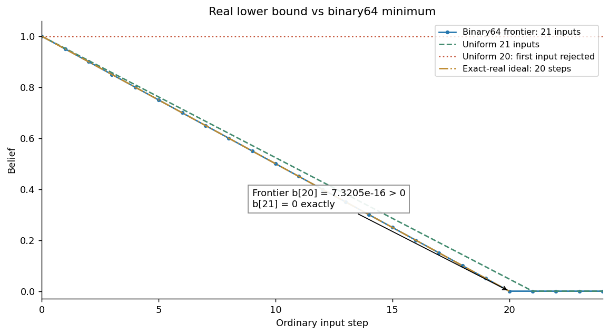
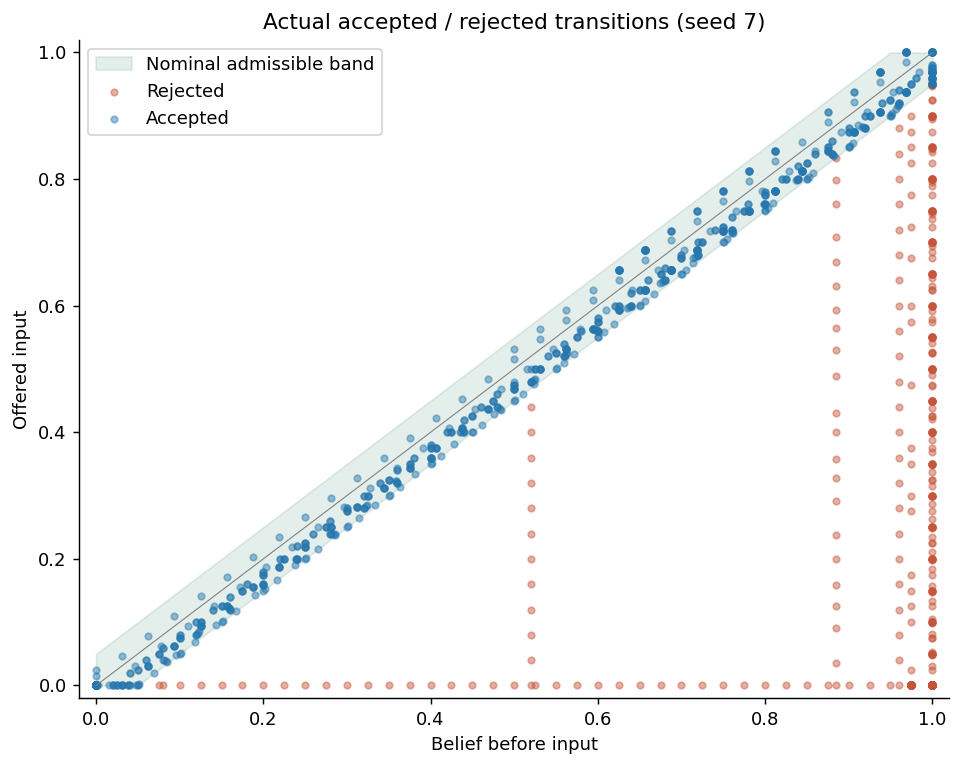
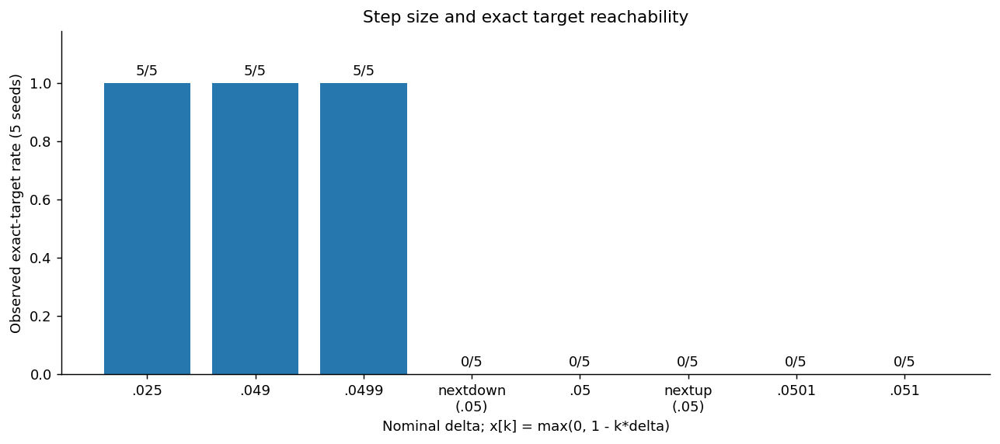
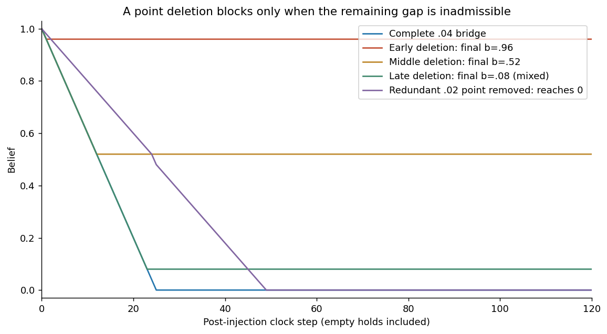
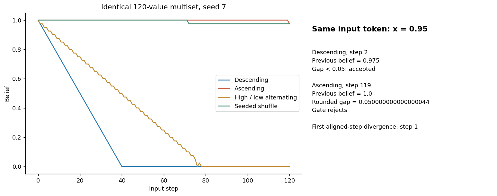
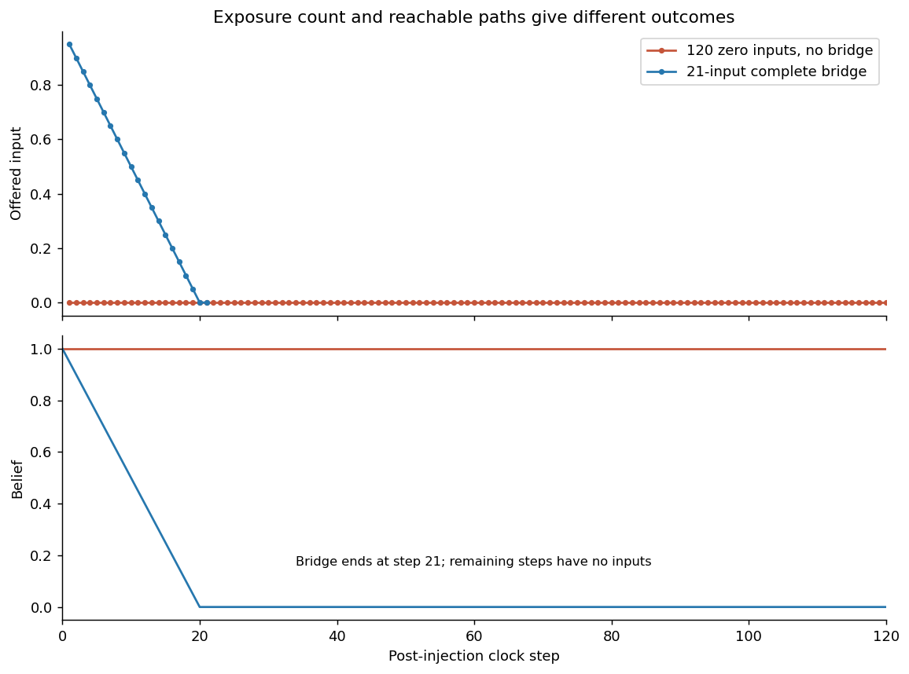
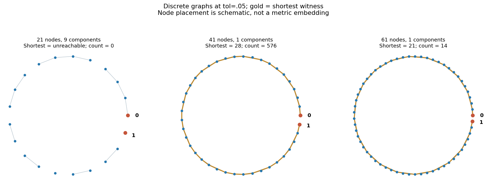
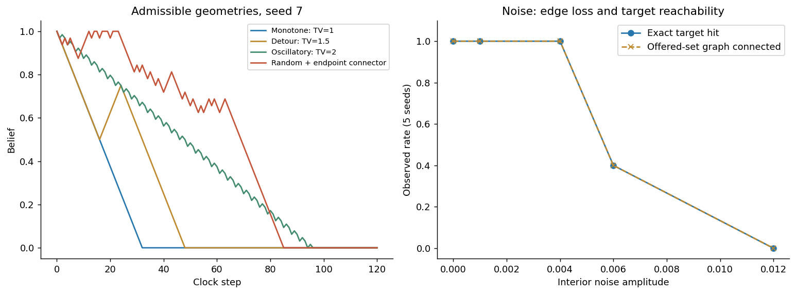

# Exp F: Admissible Bridge Geometry / Minimum Recapture Path

2026-09-17 — Python scalar synthetic experiment。既存A–E、HohoEngine、Idealを保持。

今回のgateでは、受理可能な経路によってb=1から旧anchor=0へ到達できます。**厳密な0への最短長は、実数上では20、今回のbinary64実装では21でした。** 一方、入力集合のgraphが連結でも、その集合を提示する順序によって到達しない場合があります。必要なのは実際の逐次受理規則に沿った経路です。

この最短値は実世界への推定値ではなく、固定したscalar ruleと数値表現についての結果です。Persistent EscapeとRelapseを同じ価値のある観測として扱い、tol・分類・referenceを変更していません。

## A. Baseline Reproduction / Existing State

### gitと既存成果物

開始時の作業用bundle自体はgit repositoryではありませんでした。公開snapshot外の既存原本を確認し、以下を実行しました。

```sh
git status --short
git branch --show-current
git log -5 --oneline
git diff
```

status/diffは空、branchは `release/hoho-ideal-v1`、HEADは `ed8168ae4020221a7b2c62ff8b76d5eccfcb5162`。直近5commitは `ed8168a`, `e92afa0`, `7304268`, `7236220`, `2d73cff` です。

実験成果物は原本gitの外の評価bundleにあり、その既存構造にFだけを追加しました。Eのprotocol、runner、raw CSV、validation、reference、attractor、分類、stationary/descending/gradual/abrupt、order/path fixturesを実際に確認しました。A–E全109ファイルとIdeal原本170ファイルはhash一致で保持されています。git cleanだけを実験ファイル保全の根拠にはしていません。

### Eの再現を先に実施

既存E runnerを別の出力先で実行し、**330試行・主要10 CSVがバイト一致**しました。指定baselineに相当する以下の5条件を元の5seedで個別確認し、25件とも一致しました。

| E条件 | 各5seedの結果 | D_final |
|---|---|---:|
| abrupt_return q=1 | Persistent Escape | 0 |
| gradual_drift v=.025,q=1 | Relapse、T=38 | 1 |
| 同multisetのascending | Persistent Escape | .025 |
| 同multisetのshuffle | Persistent Escape | .025または.1 |
| gradual_drift v=1,q=1 | Persistent Escape | 0 |

この一致を確認した後にFのprotocolと経路条件を固定しました。`results/baseline_reproduction.json` に再現コマンド・hash・個別結果があります。

### 固定したstate-transition rule

入力前beliefをb_t、入力をx_tとすると、既存規則は次の通りです。

\[
b_{t+1}=\begin{cases}
x_t & |x_t-b_t|\le\mathrm{tol},\\
b_t & |x_t-b_t|>\mathrm{tol}.
\end{cases}
\]

主実験は全て `tol=.05`, `R0=1`, old anchor=0, domain=`known`。D_t=|b_t−1|。通常gateにはepsilonを追加していません。state変更・Recorder・attractor判定・分類はC/D/Eをimportして再利用しています。式は説明用であり、新しいengineではありません。

既存stationary baselineでanchor=0への安定性と局所摂動からの復帰を確認した後、S=1・単発の既存evidence_revisionでb=1にします。その後は通常gateだけで更新します。全170経路を、どのtrajectoryも開始する前に `path_manifest.json` へ保存しました。

各試行は注入後120clock stepです。有限経路を提示し終えた後は空batchで状態だけを観測します。追加の0やcorrective inputは入れていません。したがって、既存の最終100step判定は保たれますが、経路終了後の保持は入力なし条件です。

### 実験規模

34条件×seed 7,17,29,41,53の5個＝170 trajectories。11,940 events（baseline 3,740＋注入170＋post入力8,030）、22,610状態行、22,270clock steps（baseline 1,870＋post20,400）を保存しました。決定論的条件ではbaseline到達後にseed差が消えます。確率的条件はrandom path、shuffle、noiseです。

既存分類ではPersistent Escape 83件、Relapse 82件、mixed 5件。厳密なtarget到達は82件でした。これは今回の条件構成における件数であり、一般的な成功確率ではありません。

## B. Minimum Bridge / Analytical Cross-check

### 実数上で証明したこと

初期1、target0、実数のτ=1/20とします。受理された更新1回の変位は高々τ、拒絶は変位0なので、L回の入力に対して三角不等式から、

\[
1=|b_0-b_L|\le\sum_{k=0}^{L-1}|b_{k+1}-b_k|\le L\tau.
\]

従って `L≥ceil(1/τ)=20`。実数上では1−k/20（k=1,…,20）が全て受理され、20で到達します。detourや拒絶はこの下限を短縮できません。

全入力を受理する指定経路 `x_1,…,x_L` の必要十分条件は、x_0=1として全ての隣接gapがτ以下であることです。さらにx_L=0なら最終targetへ到達します。これは「全入力受理」という条件付きの必要十分性です。

拒絶を許す場合、実際に受理された部分列が状態経路になります。単に入力集合に経路があることや、都合よく選んだ部分列が存在することだけでは、強制的に受理される他の入力の影響を除けません。例えばdyadicな `[31/32, 1, 30/32, 29/32, …, 0]` では、2個目の1が受理されてbeliefが戻り、その後は最初のgapが2/32となって拒絶され続けます。2個目を自由に飛ばせる別policyを仮定してはいません。

### binary64上の最短値をどう確定したか

`float(.05)` の厳密値は `3602879701896397/72057594037927936` です。小数の見かけだけでは、引算・丸め後にgateが通るとは限りません。

各bについて、

\[
f(b)=\min\{y\in\text{binary64}\cap[0,b]:\;\operatorname{fl}(|b-y|)\le\operatorname{float}(.05)\}
\]

を求めました。非負binary64のbit順序で二分探索し、得たyが受理され、その直下のfloatが拒絶されることを確認しました。0の場合はそれより小さい非負状態はありません。

正しく丸められる減算の単調性からfは非減少です。任意の現在状態bからの1回更新後はf(b)以上であり、fを反復した `m_k=f^k(1)` がk回以内に到達できる最小値になります。帰納的に、全ての経路のk回後の状態はm_k以上です。上向きdetourや拒絶を含む経路にもこの下限が適用されます。

`float_frontier.csv` の各局所最小値を、独立なFraction計算でも検証しました。差の正確な有理数値を、tolとその直上floatの中点に比較し、tieではeven丸めを反映しています。主simulationのgateにこの有理数oracleを置き換えたわけではありません。

| 判定対象 | 最短長・到達状態 |
|---|---|
| 実数、τ=1/20 | L_min=20 |
| binary64最小到達frontier、20入力後 | b=211/288230376151711744 ≈ 7.320533068622126e−16 > 0 |
| 同frontier、21入力後 | b=0、L_min=21 |
| `1−k/L`, L=19 | 初回から拒絶、b_final=1 |
| 同L=20 | 初回から拒絶、b_final=1 |
| 同L=21 | 21件全て受理、b_final=0 |

これは二種類の確認です。実数上の20は解析的証明、binary64上の21は単調frontierの証明と有限の端点証明書・実行照合を組み合わせた結果です。21という値を小さい許容誤差付きtargetにも適用することはできません。

既存Relapseは厳密な0ではなく、旧anchorの.05近傍を5clock step維持する判定です。最短float経路ではRelapse開始19、確認23、厳密target到達21でした。元の分類にあるepsilonはそのままですが、gateと厳密target判定には追加していません。



## C. Acceptance Boundary / Bridge Step Size

一定幅系列は `x_k=max(0,1−k*δ)`、k=1,…,ceil(1/δ)としました。次の結果は各5seedで同じでした。

| δ | 提示長 | 受理 / 拒絶 | 最初の拒絶 | 最終belief | D_final | target |
|---|---:|---:|---:|---:|---:|---|
| .025 | 40 | 40 / 0 | NA | 0 | 1 | 到達 |
| .049 | 21 | 21 / 0 | NA | 0 | 1 | 到達 |
| .0499 | 21 | 21 / 0 | NA | 0 | 1 | 到達 |
| nextafter(.05,0) | 20 | 0 / 20 | 1 | 1 | 0 | 未到達 |
| .05 | 20 | 0 / 20 | 1 | 1 | 0 | 未到達 |
| nextafter(.05,+∞) | 20 | 0 / 20 | 1 | 1 | 0 | 未到達 |
| .0501 | 20 | 0 / 20 | 1 | 1 | 0 | 未到達 |
| .051 | 20 | 0 / 20 | 1 | 1 | 0 | 未到達 |

`nextafter(.05,0)` はtolより小さい数値ですが、この生成式では最初の `1−δ` が.95へ丸められ、`abs(.95−1)=.050000000000000044` となるため拒絶されます。従って「nominal δ<tolなら常に通る」とは言えません。判定対象は実際の入力値とbeliefの丸め後の差です。 また、このnextbelow条件では浮動小数点の `ceil(1/δ)` が20となり、最後の提示値も `1.1102230246251565e−16` です。厳密な0は提示列に含まれません。この端点効果も `target_in_offered_values` と全入力manifestに記録し、0を後付けで追加していません。初回拒絶による遮断はこれとは独立に確認できます。

最小frontierの最初の入力は `.9500000000000001` で、.95とは異なるfloatです。gate自体を変更せず、nominal step幅と実際に生成されたedgeを分けて測定しました。今回の粗い点の間を掃引して、より精密なδ閾値を推定することはしていません。





## D. Broken Bridge / Geometry

### 単一点削除

元の有効経路はδ=.04の25入力です。元の2番目・13番目・24番目の入力をそれぞれ1個だけ削除しました。

| 条件 | 提示長 | 受理 / 拒絶 | 最初の拒絶step | 最終belief | target | 既存分類 |
|---|---:|---:|---:|---:|---|---|
| 完全bridge | 25 | 25 / 0 | NA | 0 | 到達 | Relapse |
| early break | 24 | 1 / 23 | 2 | .96 | 未到達 | Persistent |
| middle break | 24 | 12 / 12 | 13 | .52 | 未到達 | Persistent |
| late break | 24 | 23 / 1 | 24 | 約.08 | 未到達 | mixed |

最初の切断gapは約.08でtolを超えます。その後の入力は全てさらに下降するため、最後に受理されたbeliefから遠ざかり続け、復帰する経路が提示されませんでした。

一方、δ=.02の50入力から中間点1個を除くと、gapは約.04で通過できました。49入力全て受理されtargetへ到達しています。**単一点欠落が必ず経路を切断するわけではありません。** late breakを無理にPersistent/Relapseへ入れず、既存mixed分類を保持しました。

### 同じ始点・終点の異なる経路

| 経路 | 提示長 | TV（初期1を含む） | target |
|---|---:|---:|---|
| dyadic monotone、幅1/32 | 32 | 1 | 5/5到達 |
| detour、1→.5→.75→0 | 48 | 1.5 | 5/5到達 |
| oscillatory、上下動しながら下降 | 96 | 2 | 5/5到達 |
| random prefix＋事前固定connector | 82〜91 | 2.3125〜2.75 | 5/5到達 |
| 同random prefixのみ | 64 | 1.75〜1.9375 | 0/5到達 |

randomはseed固定の±1/32 walkで、境界ではclipします。connector付きは64stepの計画済みprefixから0まで1/32で下降する経路を事前に追加します。実行中の結果を見た修復ではありませんが、終点0を条件にした生成法です。無条件random walkの一般的な到達確率を測ったものではありません。

全経路とも各入力は受理可能ですが、prefixだけでは今回targetへ届きませんでした。「全edgeが受理可能」と「指定targetへ到達する」は別です。detour・振動は必要な長さとTVを増やしましたが、到達可能性を失わせませんでした。



## E. Order Mechanism

Eのgradual v=.025,q=1で使った**同じ120個のfloat値**を、下降・上昇・高低交互・shuffleへ並べ替えました。重複0も元tokenを付けて区別し、全multisetの一致を検証しました。shuffleはEと同じseed文字列を使うため、Eの5本もそのまま再現しています。

| 順序 | target到達 | 既存分類 | 代表seed7：受理 / 拒絶 | 代表seed7：最初のtarget |
|---|---:|---|---:|---:|
| descending | 5/5 | Relapse | 120 / 0 | 40 |
| ascending | 0/5 | Persistent | 1 / 119 | NA |
| high/low alternating | 5/5 | Relapse | 83 / 37 | 76 |
| shuffled | 0/5 | Persistent | 1 / 119 | NA |

同じ時計stepで最初に分岐する時点は、seed7でdescending対ascendingがstep1、descending対alternatingがstep2、descending対shuffleがstep1でした。全組の状態差・受理フラグ差を `order_divergence.csv` に保存しています。

同じstepで異なる値を出しているだけでは、先行beliefによる受理差を直接切り分けられません。そのため**同じ入力tokenそのもの**を照合しました。例えばx=.95は、

- descendingのstep2：直前belief=.975、gap≈.025なので受理。
- ascendingのstep119：直前belief=1、丸め後gap=.050000000000000044なので拒絶。

という差になりました。比較する入力値は同一であり、先行経路が作ったbeliefが異なります。全30組について同一tokenの受理差を保存し、最初の証拠と全2,189件の証拠を独立監査しました。

alternatingには37回の拒絶がありますが、後続の中間値が再び受理可能になりtargetへ届きます。これは「一度の拒絶が永久遮断を意味する」という一般化への反例です。全入力を受理するbridge completionはfalseでも、target到達はtrueです。

同じ値集合の静的graphは各順序で同じです。それでも順序で到達が分かれるので、静的なpath存在性だけでは提示順序付きの到達を保証できません。



## F. Reachability vs Exposure

| 条件 | post提示数 | 受理数 | 最終belief | D_final | 既存分類 |
|---|---:|---:|---:|---:|---|
| 大量の0だけ | 120 | 0 | 1 | 0 | Persistent |
| 最短float bridge | 21 | 21 | 0 | 1 | Relapse |
| 入力なし | 0 | 0 | 1 | 0 | Persistent |

各5seedで一致しました。旧anchor入力の提示量だけではRecaptureを説明できません。完全bridgeでは、より少ない入力でも受理された状態遷移の連鎖によって到達しました。

ただし、これを「静的graphが連結ならRecaptureする」と読み替えることはできません。今回直接支持されるのは、**提示量に加えて、実際の順序に沿って利用できる受理経路が重要**ということです。必要十分性は、指定した逐次更新則・初期状態・有限入力列について判断します。

`TV`は初期1→最初の入力を含めた提示列の総変動、`TV_input_only`は提示列内部、`actual_state_TV`は実beliefの総変動です。alternatingでは提示TV=38.05でも実状態TV≈1.05でした。拒絶された大きな動きは状態の移動量になりません。



## G. Graph Cross-check

分析用の有限graphで、頂点をbinary64値 `i/n`、辺を既存offerが許可する更新としました。primaryとの比較はtol=.05です。self-loopは除き、双方向の辺を1本として保存しました。

| 頂点構成、tol=.05 | node数 | 接続成分 | 1→0最短長 | 最短経路数 |
|---|---:|---:|---:|---:|
| i/20 | 21 | 9 | 到達不能 | 0 |
| i/40 | 41 | 1 | 28 | 576 |
| i/80 | 81 | 1 | 23 | 128 |
| i/40＋float frontierの頂点 | 61 | 1 | 21 | 14 |

全binary64状態での最短21に対し、離散gridでは必要な中間floatがないため、最短長が伸びたり接続が切れたりします。frontierのwitnessを頂点に含めると21が再現しました。全てのgraph witnessを既存offerで逐次再生してtarget到達を確認し、辺・BFS距離・最短経路数を別の有理数gate計算でも照合しています。

i/40とEの `1−k*.025` は数学的な小数では同じ点を意図していても、実際のfloat頂点が完全一致するとは限りません。graphの比較は保存した実際の頂点値とhexに対して行い、nominal spacingだけで同一視しません。

tol変更は**分析graphだけ**で実施しました。

| grid | tol=.049 | tol=.05 | tol=.051 |
|---|---:|---:|---:|
| i/20 | 到達不能、21成分 | 到達不能、9成分 | 最短20、1成分 |
| i/40 | 最短40 | 最短28 | 最短20 |
| i/80 | 最短27 | 最短23 | 最短20 |

主実験のtolは全170試行で.05のままです。graph countは「最短経路の数」であり、全てのwalkの数ではありません。往復可能な辺があるため任意長のwalkは無限に作れます。



## H. Robustness / Edge Loss

δ=.04の有効25入力bridgeの内点にUniform(−η,η)を加え、終点0は固定しました。同じseedではnoise level間で同じ単位乱数を使っています。経路は事前生成であり、失敗時の再sampling、gap補修、入力追加は行っていません。

| η | 提示列の全edgeが受理可能 | 静的graphが連結 | 厳密target到達 |
|---|---:|---:|---:|
| 0 | 5/5 | 5/5 | 5/5 |
| .001 | 5/5 | 5/5 | 5/5 |
| .004 | 5/5 | 5/5 | 5/5 |
| .006 | 2/5 | 2/5 | 2/5 |
| .012 | 0/5 | 0/5 | 0/5 |

η=.006ではseed29/41/53でそれぞれstep10/7/15に最初の拒絶が起きました。η=.012では全seedにgapが生じました。このnoise範囲では生成列が単調下降を保つため、切れたgapを後で上向き入力により回復することはありませんでした。

提示長は全て25で固定です。noiseによる「必要な修復入力数」や「path長の自動延長」は実験していません。到達したものは25stepで0へ到達し、切断されたものは未到達でした。この5seedの割合は **observed rate in this synthetic setup** であり、精密な到達確率やnoise閾値の推定ではありません。



## I. Supported Claims / Reference Integrity

このコードと実験範囲から支持されるのは次の点です。

1. 実数scalar gateでは距離1の移動に最低ceil(1/τ)更新が必要で、τ=1/20なら20で達成できます。
2. 既存binary64 gate、b=1→厳密な0では最短21です。20回後の最小残差と、その隣接floatの受理/拒絶を確認しました。
3. 単調bridgeでtolを越えるgapを作り、以後さらに下降するだけなら、そのgapから先へ到達できません。余裕のある点の削除や、後で受理範囲へ戻る系列ではこの遮断は必然ではありません。
4. 同じmultisetでも先行beliefの違いが同一入力の受理差となり、順序による到達差を説明します。
5. 大量の旧値提示より少ない完全bridgeでRecaptureが生じる対照例があり、量だけでは十分な説明になりません。
6. 離散化によってgraphの最短長・接続性が変わります。保存したwitnessは同じ実装で再生可能でした。
7. 今回の単調noisy bridgeでは、受理可能edgeの切断とtarget到達不能が一致しました。

R0=1はCの既存immutable Reference/domainで固定し、全eventのhashを照合しました。旧anchor=0も固定です。path generatorはReferenceを変更できず、実行中のbelief、分類、将来結果を参照して経路を変更しません。reference選択・削除・重み変更・評価範囲縮小の機構は追加していません。

C_tとD_tは別々に保存しました。Cはそのstepで受理された通常入力の更新前agreement平均で、受理がないstepはNAです。Cをtarget判定や分類に使用していません。通常gate内の微小移動では高いCが保たれてもDが増える既存構造を保持しています。

### Limitations

- 1次元、固定domain、既知のscalar、固定reference・tolという限定されたモデルです。
- exact targetと.05近傍Relapseは異なり、20対21は厳密なfloat端点に依存します。近似target一般への境界ではありません。
- 表示上近いfloatや同じnominal δを同一視できません。入力生成式の丸めも含めた結果です。
- 有限経路後は入力なしで120stepまで観測しています。将来の任意入力に対する持続性は調べていません。
- random connectorは終点を固定する構成であり、無条件random dynamicsではありません。
- noise条件では修復・再試行をしないため、noiseによる追加最短長は推定していません。
- 受理経路存在、指定順序での到達、既存Relapse分類を区別しています。
- Reference integrityは信頼されたharness内の操作範囲についての保証です。Python環境全体への悪意ある書換えに対するsecurity保証ではありません。
- native Juliaの既存runtime問題は解決していません。

## J. Unsupported Claims

今回の結果から次は主張しません。

- 実際のLLMがこのscalar gateで動作する。
- 人間のbelief dynamicsを説明する。
- RSSI一般に同じ最短pathが存在する。
- AI alignmentの一般解を示した。
- 高次元系でも同じreachability geometryが成立する。
- HohoEngine nativeに同じ通常再帰が実装されている。
- 静的graphの接続性が、全ての入力順序でのRecaptureを保証する。
- 一度でも拒絶された経路は永久に到達不能になる。
- 数学的相転移・ヒステリシスを証明した。

## K. Remaining Work / Validation / Deliverables

Exp Fの必須作業は完了しています。実行・raw保存・解析・8図・独立監査・既存回帰・再現性確認に未完了はありません。以前のJulia runtime問題は未解決ですが、今回の成功条件には含めず、native実装を追加していません。

### 実際の主コマンド

元bundleで実行した主コマンド（公開snapshotではrepository rootから実行）：

```sh
python experiments/rssi_recapture_dynamics/run_experiment.py --output-dir <temporary-output-directory>
python experiments/rssi_admissible_bridge/run_experiment.py
python experiments/rssi_admissible_bridge/analyze_reachability.py
python scripts/validate_snapshot.py
python experiments/rssi_admissible_bridge/make_figures.py
```

元bundleの環境依存ログは公開対象外とし、検証件数はrepository rootの `results/frozen/VALIDATION_HISTORY.json` に固定しています。公開snapshotの再現は `python scripts/reproduce.py --series f` を使用します。

| 検証 | 結果 |
|---|---|
| F独立validation | 11グループpassed |
| raw event/state再計算 | 全11,940 events / 22,610状態行一致 |
| 分類・target・gap・TV・順序 | 全170試行、30 order pairsを照合 |
| E control/order summary | 30件で全共通結果フィールド一致 |
| binary64 frontier | Fractionの丸めoracleと直下floatで端点最小性を確認 |
| graph | 10graphの辺・成分・BFS・最短数・witnessを独立確認 |
| negative fixtures | 順序、拒絶後回復、5step判定、reference domainを確認 |
| fixed-seed reproducibility | 全11 CSVがバイト一致、全入力manifestも一致 |
| Exp E regression | 既存11グループpassed |
| Exp D regression | 既存10グループpassed |
| Exp C regression | 既存12グループpassed |
| relevant RSSI tests | 既存12チェックpassed |
| 原本保全 | A–E 109ファイル、Ideal原本170ファイル一致 |

追加ファイルはFフォルダ内のprotocol/config、runner、解析・検証・図生成script、CSV/JSON、README、本レポートです。既存utilityをコピーして改変せず、importで再利用しました。再実行に必要なA–Eの依存ファイルも変更せずZIPに同梱しています。
