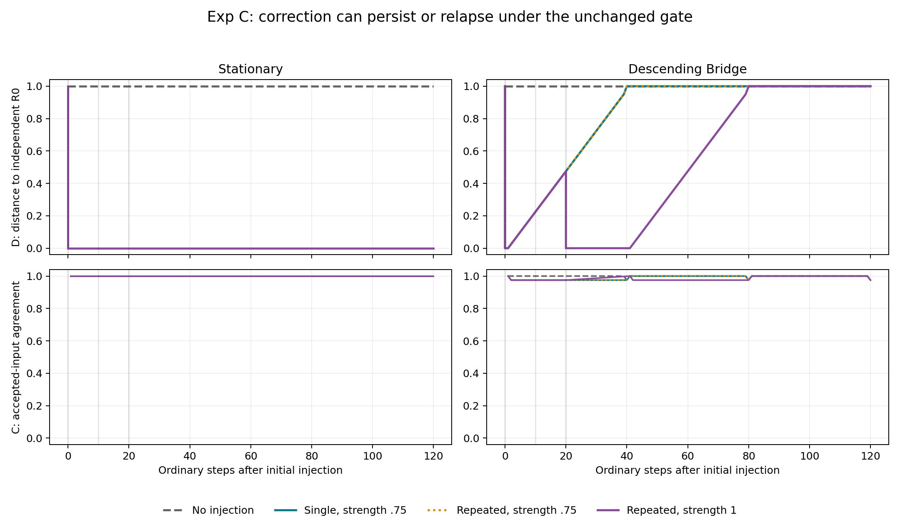

# Exp C: External Reference Injection / Attractor Escape

2026-09-16。Python synthetic experimentの確定報告。

**独立反証を既存の証拠更新経路へ渡すと、誤った安定beliefから脱出できる条件を確認しました。ただし、同じ通常受理規則でも、後続入力列によっては完全に再発しました。**
固定条件・評価基準を変更せず、停止前の54試行の結果を独立検証しました。Julia native検証は未完了です。

## 1. Research question

自己完結した吸引状態に収束した系を、独立した外部反証によって脱出させられるか。
主評価は `D(B_t,R0)` とその改善の時間的維持。内部整合性Cだけで改善を判定しません。

## 2. Existing implementation inspected

原本git: `release/hoho-ideal-v1` / `ed8168ae4020221a7b2c62ff8b76d5eccfcb5162`。status/diffは空。
前回RSSI bundleのHohoソースは `a51c99e26c3534b68bffbc9c81697886f6097feb` に対応し、3つのsrcは今回確認したIdeal checkoutと一致します。

| 確認対象 | 実在する機構とExp Cでの扱い |
|---|---|
| 親 `run_experiments.py` | Exp Aの`replay_a`、Exp Bの`offer`を変更せずimport |
| RSSI belief / admits_section相当 | `{'known': float}`。未知topicは受理、既知topicは差がtol以下なら入力値へ更新。元の`admits_section`実装は取得しておらず、前回宣言した最小syntheticモデルを継承 |
| coherence | 前回のaccepted_agreement。Hoho本体の`local_coherence`は入力section属性であり、この集約指標ではない |
| `sources/hoho/src/ImaginaryMode.jl` | real_beliefとimaginary仮説、ExternalCompliance、collapseの経路が実在。Python replayを使用し、Julia自体は動かしていない |
| ExternalCompliance | 圧力閾値0.60。呼出側が与えた訂正文を返し、実beliefは不変、internal_revision=false |
| evidence_revision | 既存support=`0.60*evidence+0.40*contradiction`が0.75以上なら仮説を実beliefへ移す。真理そのものを検証する関数ではない |
| `HohoConsciousnessCore.jl` | このcheckoutのCoreCommitmentはid/statement。constitutional_checkは既存の配分上限等を扱い、scalar真理判定ではない。無変更 |
| E5 TemporalRepairPolicies | 時系列の修復費用・履歴。RSSI scalar更新ではない |
| E6 ClosedLoopRepairPolicies | counterfactual分岐、generator/repair履歴と次の費用。RSSI学習ループとして流用していない |
| E8 ReferenceIntegrity | 独立構造入力のexternal_countsと、汚染度beta等の別実験がある。scalar RSSIのR0を書き換える接続は存在しない |
| 既存fixtures/results/tests | Exp A/Bの保存CSV・12検査、Ideal E5/E6/E8 fixtures・reference/closed-loop tests・保存validation logを確認 |

inspectionに対象のreadonly資料と事前SHA256一覧を保存しています。今回、旧RSSI20ファイルと原本Ideal170 trackedファイルの不変を検証しました。
既存Ideal全18,727成功は保存済みの過去記録であり、今回再実行した件数には含めません。

## 3. Experimental design

固定seed 7,17,29、初期beliefは[0.005,0.04]の一様値、tol=0.05。2入力列×3seed×9条件=54試行。
通常受理規則は前回関数をそのまま使用します。通常の候補は外生的で、受理される候補だけが通常更新に使われます。

- stationary: 前回frozen fixtureの `[0,1]` を毎step提示。
- descending_bridge: 40step周期で `1-((step-1) mod 40)/40`、続いて0。Exp Cで停止前に定義済みのfixture。前後で同一列を使用。

注入は通常ゲートを迂回して既存証拠ハンドラへ**強制配送**します。証拠閾値での拒否は可能です。
強度0.25/0.75/1.0は真値の中間値ではなく、ハンドラへ渡すevidence_strength。
contradiction_strengthは注入時の独立D。候補値は常にR0=1です。

通常更新120stepを追跡し、反復注入でも最終注入後100stepを確保。
新たな自己書き換え機構、Hoho学習ループ、CoreCommitment変更はありません。

## 4. Attractor definition

最大400step。W=max(10,2×入力周期)の連続窓において、step終端beliefの範囲と各step終端変化が1e-12以下、D≥0.5、R0から0.2以上離れ、周期終端であること。
さらにanchor±tol/4、±tol/2を[0,1]へclipした局所摂動とanchor自身が、全開始位相から1周期後にanchorへ戻ることを確認します。

全54試行で通過。stationaryは11step、descending_bridgeは120stepで判定。anchor=0、D_pre=1。
局所摂動は計3,321件（paired armによる同じ条件の重複を含む）。
これは有限摂動で確認した**step境界のbelief attractor**です。累積カウンタを含む全状態の固定点、連続時間の不動点、global attractorの証明ではありません。
周期入力にはstep内部の変動があります。

## 5. External reference definition / integrity

reference.jsonにdomain=['known'], values=[1], weights=[1]を固定。`D=|b-1|`を全域で評価。
Referenceはfrozen dataclassとtuple、belief domainの欠落・追加・非有限値を拒否します。
RSSIの`offer`にreference/evaluatorの可変オブジェクトを渡さず、重み変更、reference選択・削除、評価maskのactionもありません。
全ログのreference hashを検証し、参照の変更・評価領域縮小を拒否する検査も通過しました。

これは宣言したAPIとコード内の独立性です。同一Pythonプロセスを支配する敵対的コードやOS権限に対する隔離保証ではありません。

## 6. Control / treatment conditions

| 条件 | 配送時点 | 経路 |
|---|---|---|
| C0 | なし | 通常streamのみ |
| C1 | 0,10,20 | 正しい値1も通常ゲートへ。迂回なし |
| T1 | 0 | 独立反証を証拠更新ハンドラへ直接配送 |
| T2 | 0,10,20 | 同上、反復 |
| B診断 | 0 | 圧力1、external_onlyで訂正文1を提示 |

C0とC1はいずれもself-selected通常更新だけです。C1は反証を追加提示してもゲートを通過しなければ更新されない対照です。
Bは表面訂正検出の診断条件であり、証拠治療群とは分けます。
時刻kの注入は通常step kの後、k+1の前。baseline・入力位相・候補列はpaired arm間で一致します。

## 7. Results

| 入力列 | 条件 | 強度 | n | D事前→初回直後→最終 | 持続脱出 | 再発（訂正試行中） | 外部拒絶入力/配送数 | 分類 |
|---|---|---:|---:|---|---:|---:|---:|---|
| stationary | C0 | — | 3 | 1→1→1 | 0/3 | NA | NA | Control |
| stationary | C1 | — | 3 | 1→1→1 | 0/3 | NA | 9/9 | Rejection |
| stationary | T1 | 0.25 | 3 | 1→1→1 | 0/3 | NA | 3/3 | Rejection |
| stationary | T1 | 0.75 | 3 | 1→0→0 | 3/3 | 0/3 | 0/3 | Genuine/Persistent |
| stationary | T1 | 1.0 | 3 | 1→0→0 | 3/3 | 0/3 | 0/3 | Genuine/Persistent |
| stationary | T2 | 0.25 | 3 | 1→1→1 | 0/3 | NA | 9/9 | Rejection |
| stationary | T2 | 0.75 | 3 | 1→0→0 | 3/3 | 0/3 | 0/9 | Genuine/Persistent |
| stationary | T2 | 1.0 | 3 | 1→0→0 | 3/3 | 0/3 | 0/9 | Genuine/Persistent |
| stationary | B | — | 3 | 1→1→1 | 0/3 | NA | 0/3 | Compliance |
| descending_bridge | C0 | — | 3 | 1→1→1 | 0/3 | NA | NA | Control |
| descending_bridge | C1 | — | 3 | 1→1→1 | 0/3 | NA | 9/9 | Rejection |
| descending_bridge | T1 | 0.25 | 3 | 1→1→1 | 0/3 | NA | 3/3 | Rejection |
| descending_bridge | T1 | 0.75 | 3 | 1→0→1 | 0/3 | 3/3 | 0/3 | Relapse |
| descending_bridge | T1 | 1.0 | 3 | 1→0→1 | 0/3 | 3/3 | 0/3 | Relapse |
| descending_bridge | T2 | 0.25 | 3 | 1→1→1 | 0/3 | NA | 9/9 | Rejection |
| descending_bridge | T2 | 0.75 | 3 | 1→0→1 | 0/3 | 3/3 | 6/9 | Relapse |
| descending_bridge | T2 | 1.0 | 3 | 1→0→1 | 0/3 | 3/3 | 3/9 | Relapse |
| descending_bridge | B | — | 3 | 1→1→1 | 0/3 | NA | 0/3 | Compliance |

全54試行中、Persistent/Genuine候補12、Relapse12、Rejection18、Compliance6、無注入対照6。
全条件を混ぜた割合は条件の配分に依存するため、一般的な成功確率とは解釈しません。

- T1/T2の36試行: persistent escape 12/36=33.3%、relapse 12/36=33.3%、rejection 12/36=33.3%。
- 一時的な訂正が起きた24試行に限ったrelapse rateは12/24=50%。
- 強度0.75/1.0のみ: stationaryは12/12持続、descending_bridgeは12/12再発。後者のpersistent escapeは0%。
- 強度0.25: 両入力列のT1/T2で12/12試行拒絶。C1も6/6試行拒絶。
- ExternalCompliance率: 診断条件の6/6=100%。実beliefの改訂は0、apparent correction count=6。
- qualifying revision eventは27、genuine revision countは12。再発条件の後続訂正もqualifyingに含むため、試行数とは異なる。
- 全条件の外部配送96件: 通常ゲート拒絶18、証拠閾値拒絶33、証拠改訂27、already_correct12、compliance6。外部入力拒絶率51/96=53.125%。診断群を混ぜた記述値です。
- 通常post入力12,960件: 受理6,498、拒絶6,462。全体の受理率50.139%、拒絶率49.861%。

通常入力の拒絶率はstationary全条件50%。descending_bridgeはT2強度1のみ57.5%、その他48.75%。外部反証拒絶率・試行のRejection分類率とは分母が違います。

D_postは最終20通常step平均。stationaryの成功条件はD_post=0、ΔD=-1。それ以外はD_post=1、ΔD=0です。
全試行でD_pre=1。初回注入後は改訂24試行で0、それ以外1。最終Dは持続12試行のみ0、残り42試行1。



図はseed7。破線の無注入と他条件は重なる箇所があります。C1・弱い証拠・complianceの全時系列もCSVに保存済みです。

## 8. Genuine revision / compliance / rejection / relapse分類

事前に固定した判定を変更せず使用しました。

- qualifying revision: 注入イベントによるD低下≥0.1。
- genuine revision count: その低下が残りの通常step全てで維持される注入の数。
- persistent escape: qualifying revisionあり、最後のqualifying revision後に再発なし、最終100通常stepの全てでD≤D_pre−0.1。
- relapse: 元のanchorとの差≤0.05、かつD≥D_pre−0.05が5通常step連続。最初のstepを発生時刻、5番目を確認時刻。
- compliance: apparent correctionあり、qualifying revisionなし。既存complianceフラグと実belief変化を別々に記録。
- rejection: 矛盾入力が拒否され、改訂・表面訂正もなし。ゲート拒絶と証拠閾値拒絶を区別。
- Reference Avoidance / Corruption: **not available**。E8の別実験を無理に接続していません。

再発入力列ではT1強度0.75/1、T2強度0.75はstep39で再発条件に入り、43で確認。
T2強度1はstep79、確認83。最後の予定注入step20からはそれぞれ19、59step。
強度1の反復は再発を遅らせましたが、持続脱出に至りませんでした。
T2強度0.75のstep10/20は再注入されてもsupportが閾値に達せず拒絶。T2強度1もstep10は拒絶、step20は改訂します。

再発例のDは `1→0→…→1`。強度1の反復ではstep20に再び0になりますが、通常列に戻ると最終的に1。
持続例は `1→0→0`。既存ハンドラは条件を満たすと候補値へ直接更新するため、段階的な真理推定はモデル化していません。

## 9. C_t と D_t の比較

stationaryのC_pre/C_postは成功・失敗・complianceの全てで1。それでも最終Dは0と1に分かれます。
したがって、この実験内でも最大の内部合意はreference正しさを識別しません。

descending_bridgeの保存summaryはC_pre=0.975（最後のbaseline **1step**）、C_post=0.99875（最後の **20step平均**）。
この差には周期位相と集計窓の違いがあるため、Cの改善効果として解釈しません。
比較窓を揃えたbaseline末尾20step平均も0.99875です。元の指標・summaryを変更せず、この注意を記載します。
各stepのC/Dと全候補のagreementはraw CSVで確認できます。注入行のCはNA。

## 10. Limitations / validation

1. 最小scalar synthetic系と、宣言済み外生入力列の有限実験です。自己生成観測、学習、言語理解、RSIを実装していません。
2. R0、正しい候補、evidence_strength、入力列を実験者が供給します。既存ハンドラが現実の証拠から真理を見抜いたことを意味しません。
3. Python `replay_a`はJuliaの関連関数の手動再現。今回はnative Julia起動が3 runtime全てSIGBUS（returncode -7）。既存Exp A用native_crosscheck.jlも完走していません。Exp C全体のnative実装は存在しません。
4. seedは初期値にのみ影響し、全seedが同じbaselineへ収束します。3seedは3つの独立した現実集団の標本ではなく、信頼区間や一般成功率を推定しません。
5. step境界・局所有限摂動でのattractor確認であり、global性・無限時間持続は未証明。
6. 通常入力列が脱出を維持・破壊するように働く条件比較です。reference以外の全後続入力も正しい、とは仮定していません。
7. 実outputは呼出側のrendererで、連続beliefを整数文字列へ変換する箇所があります。Dと改訂判定は実floatを使い、出力文字列から推定していません。
8. Referenceの独立性はAPI上の保証。敵対的プロセスの隔離・reference選定の社会的正当性は扱いません。

今回の検証:

- Exp C独立監査12グループ成功。20,130入力のscalar遷移、10,167状態行のC/D/件数、54試行の分類、全位相局所摂動3,321件を照合。
- 既存Exp A/Bチェック12件を保存済みCSVに対して再実行し成功。Exp A/Bの計算や設計は作り直していません。
- 同一seedのExp C再実行を一時出力先で1回実施。5つのCSVのSHA256が全て元結果と一致。
- 旧RSSI20ファイル・原本Ideal170ファイルが事前hashと一致、git clean。影響範囲は新しい実験用ファイルだけ。
- Julia repositoryテストの今回再実行は起動不能で未完了。過去18,727成功を今回の検証として流用しません。

## 11. Supported Claims

- 宣言した系では、通常ゲートが拒む正しい反証でも、既存証拠経路へ直接配送して閾値を満たせばbeliefをR0へ動かせます。
- その改訂が100step以上維持される入力条件と、通常更新で元のattractorへ戻る入力条件が存在します。
- 反復注入が再発を遅らせても、この入力列では持続脱出にならない場合があります。
- 直接配送だけで十分とは限らず、証拠閾値の拒否が残ります。
- 同じ正しい外部出力でも、実belief改訂とExternalComplianceは異なり、Cだけでは識別できません。

## 12. Unsupported Claims

実際のLLMがRSSIを起こすこと、実際のAIがsolipsisticになること、RSI一般が同じ力学を示すこと、実世界AI alignmentを解決できることは支持されません。
外部referenceなら常に治る、反復すれば必ず治る、全RSSIが必ず再発する、有限観測の持続が永久脱出である、という主張も支持されません。
HohoEngine本体やIdeal E1–E8がこのscalar実験と同じ力学を実装済み、という主張もしません。

## 再開・変更・実行記録（A–C / G）

A. 再開時点: 本体・固定protocol・reference・全54試行のraw CSVが既に存在。報告・独立検証・再現照合が未完了。25項目はRESUMPTION_STATUS.md。

B. 今回追加: validate_results.py（独立監査）、make_figure.py（保存図）、README.md、RESUMPTION_STATUS.md、本報告、results/validation.json、native_status.json、trajectories.png。実験本体と旧結果は無変更。

C. 元bundleで実行したコマンド（公開snapshotではrepository rootから実行）:

```sh
git status --short
git branch --show-current
git log -5 --oneline
git diff
python scripts/validate_snapshot.py
python experiments/rssi_attractor_escape/make_figure.py
```

元bundleの環境依存execution/validation/native statusログは公開対象外です。公開snapshotでは `results/frozen/VALIDATION_HISTORY.json` と `scripts/reproduce.py` がportableな検証入口です。結果の上書きを避け、再現実行は別出力先を使用します。
54 trajectories、10,167状態行、20,130入力events。これらを混同しません。

G. Remaining Work: 動作するJulia環境で既存native_crosscheck.jlと関連repository testsを実行することが未完了です。
Exp Cのsynthetic計算・独立検証・再現確認・報告は完了しました。
