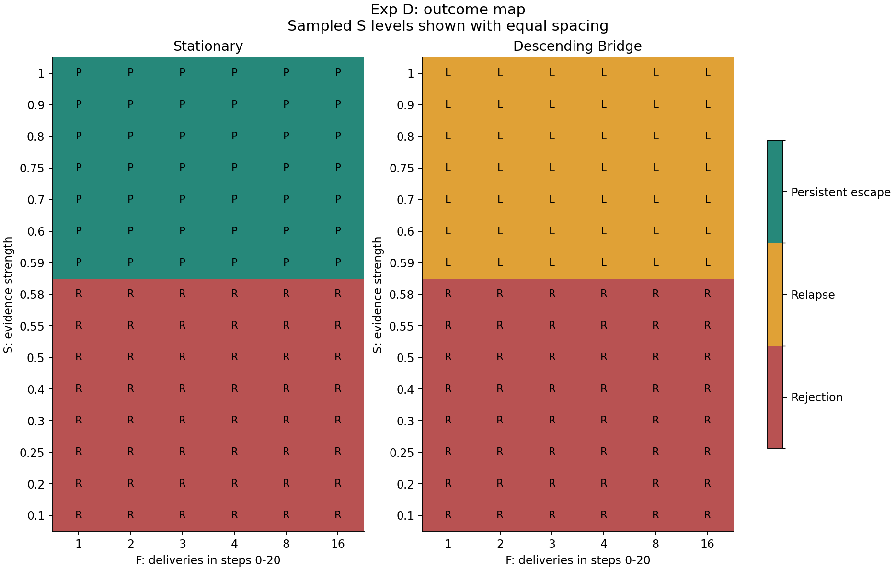
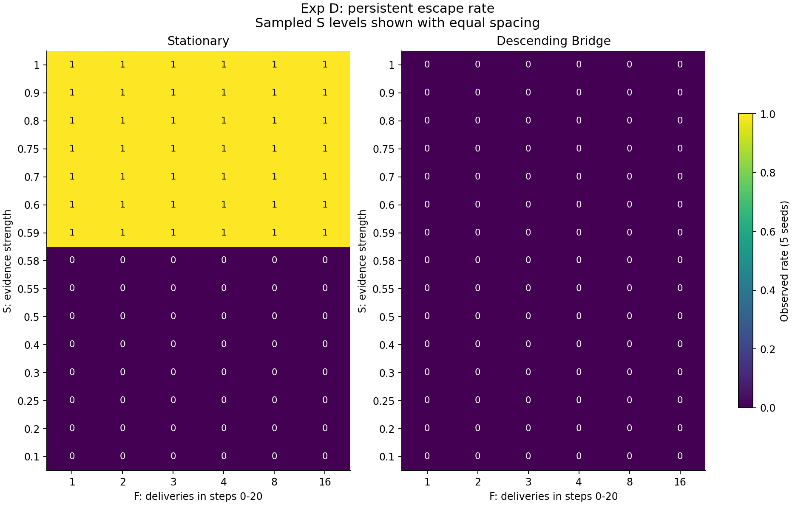
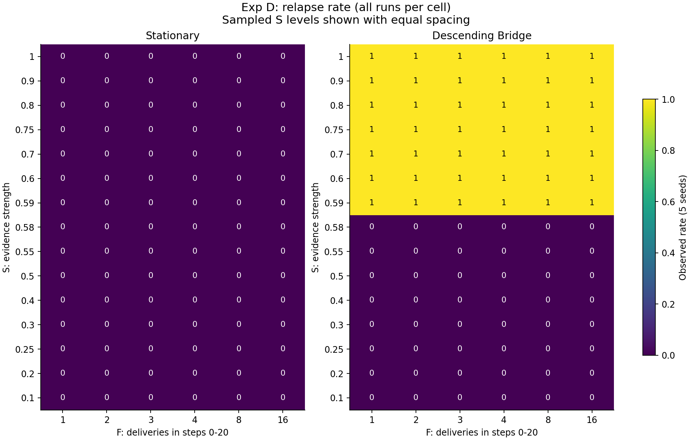
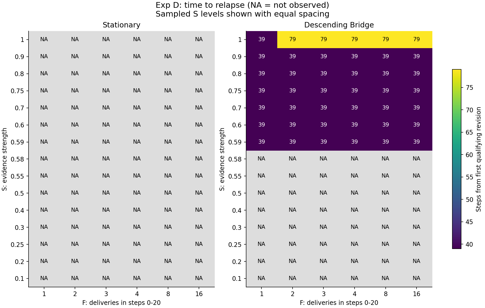
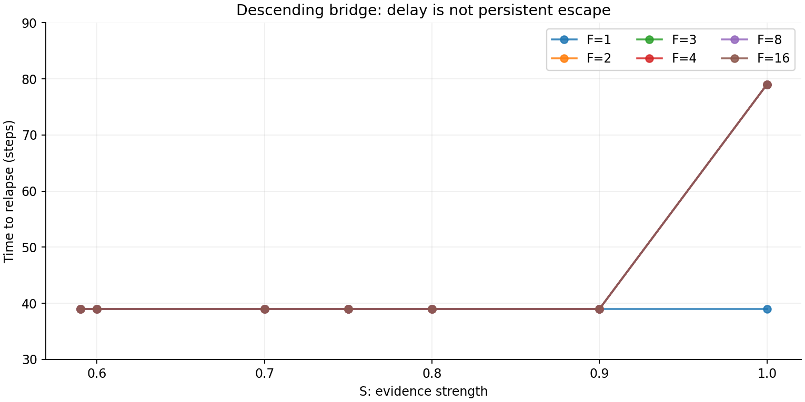
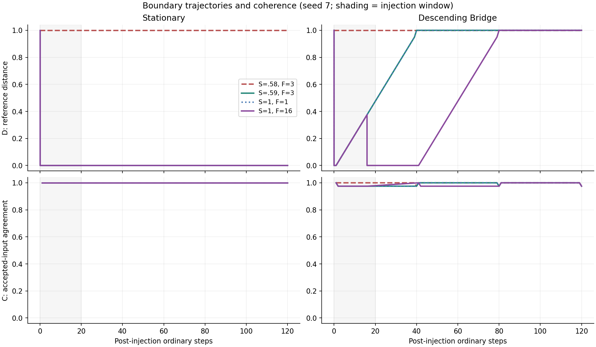
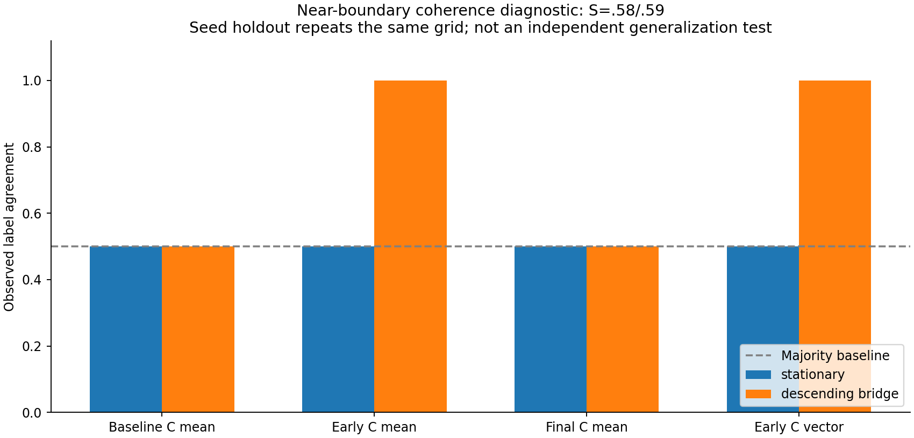

# Exp D: Attractor Escape Boundary / Critical Transition

2026-09-17 — Python synthetic experiment

**今回のS×F範囲では、同じ通常入力列の中でRejection→Relapse→Persistent Escapeという3段階の遷移は観測されませんでした。**
stationaryでは拒絶から持続脱出へ、descending_bridgeでは拒絶から再発へ切り替わりました。
両入力列の初回改訂境界は同じでしたが、その後の持続性は異なりました。

## A. Exp C Reproduction / 既存状態の確認

作業前に実行した原本gitの確認:

```sh
git status --short
git branch --show-current
git log -5 --oneline
git diff
```

原本は公開snapshot外のHohoEngine repositoryです。
branch `release/hoho-ideal-v1`、HEAD `ed8168ae4020221a7b2c62ff8b76d5eccfcb5162`。
直近5件はed8168a/e92afa0/7304268/7236220/2d73cff。変更・未追跡ファイル・diffなし。
当時の実験bundleは別のgit管理外フォルダで、新規D成果物だけをその`experiments/`配下へ追加しました。

確認した既存成果物: 親`run_experiments.py`のExp A replay/Exp B offer、Exp A/B報告と保存結果、Cのrunner/protocol/reference、全5 CSV、execution/validation、reproducibility hash、manifest。
Exp Cの全54試行を**隔離コピー**で検証・再生成し、3分類を含む5 CSVが完全一致しました。12検証グループと既存RSSI12チェック成功。
不一致はなく、Dへ進む前提を満たしました。記録は`results/exp_c_regression.json`。

Exp CのReference、Recorder、reach_attractor、normal_batch、summarizeを直接importしています。
実装をコピーして別の分類を作ることや、定数のmonkey-patchは行っていません。
Hoho/Ideal側の学習ループを追加せず、Julia関連経路のPython replayという前回の境界を維持しています。

## B. Experiment Size / 固定設計

| 項目 | 値 |
|---|---|
| S | 0.1, 0.2, 0.25, 0.3, 0.4, 0.5, 0.55, 0.58, 0.59, 0.6, 0.7, 0.75, 0.8, 0.9, 1.0 |
| F | 1, 2, 3, 4, 8, 16 |
| seed | 7, 17, 29, 41, 53 |
| 通常入力列 | stationary / descending_bridge、Cと同一 |
| 主grid | 15×6=90cell/入力列、計180cell |
| 主trajectory | 180×5=900 |
| 対照trajectory | 無注入10、通常ゲート経由の反証10 |
| 全trajectory | 920 |
| 状態行 | 176,710 |
| 入力event | 346,450（通常341,320、外部配送5,130） |
| baseline通常step | 60,260 |
| post通常step | 110,400（各120） |
| 通常step合計 | 170,660 |

step合計は全試行のbaseline+postを数え、同じpaired baselineの繰り返しも含みます。入力event、状態観測点、trajectoryの本数は異なる量です。
再現検証の再実行分は上記件数に二重計上していません。

Sの意味は既存evidence_strengthのまま。`support=0.6*S+0.4*D_before`が0.75以上で、候補R0=1を実beliefへ移します。
強度を段階的belief補間の係数に変更していません。弱い配送を繰り返してもevidenceが累積する機構はありません。
0.58/0.59は既存閾値式から主実行前に固定した点であり、結果を見て追加した点ではありません。

Fは固定期間[0,20]内の配送回数です。

| F | 予定注入step |
|---:|---|
| 1 | 0 |
| 2 | 0,20 |
| 3 | 0,10,20 |
| 4 | 0,7,13,20 |
| 8 | 0,3,6,9,11,14,17,20 |
| 16 | 0,1,3,4,5,7,8,9,11,12,13,15,16,17,19,20 |

F>1は20*i/(F−1)を最近接整数へ丸めます。F=1/3はExp Cの単発/反復と一致します。
全て120通常stepを追跡し、最終注入後100step以上を確保。Fが異なると注入時点も変わり、全scheduleが入れ子ではないため、Fの効果はこのschedule族に条件付けられます。
入力列は調整変数にせず、Cから継承した2層として別々に評価します。

### 継承した定義

- `D=|b−1|`。独立reference=1、全domain=['known']、重み1。選択・削除・書き換え・範囲縮小はRSSIのactionに存在しません。
- 通常更新はtol=.05以下の入力だけを受理し、その値へ更新。
- Cは受理した通常入力に対する`mean(1−|input−belief_before|)`。観測なしはNA。
- attractorはW=max(10,2*period)の安定窓、十分なreference距離、周期終端、全位相の局所摂動復帰を要求。step数経過だけでは判定しません。
- qualifying revisionは注入によるD低下≥.1。
- relapseはanchor近傍≤.05かつD≥D_pre−.05が5通常step連続。最初の点を発生時刻、5番目を確認時刻。
- persistent escapeは改訂があり、最終qualifying revision後に再発なし、最終100通常stepの全てでD≤D_pre−.1。
- rejectionなどの最終分類はC.summarizeのコードをそのまま使用。

**D_postはCと同じ最終20step平均です。注入直後はD_immediate_firstであり、両者を置換していません。**
全試行でbaseline anchor=0、D_pre=1。全seedが同じanchorへ到達しました。

## C. Phase Structure

| 入力列 | 検査したS領域 | F | 主試行数 | outcome | 観測割合 | D事前→初回直後→最終 |
|---|---|---|---:|---|---:|---|
| stationary | S≤0.58 | 全6水準 | 240 | Rejection | 100% | 1→1→1 |
| stationary | S≥0.59 | 全6水準 | 210 | Persistent Escape | 100% | 1→0→0 |
| descending_bridge | S≤0.58 | 全6水準 | 240 | Rejection | 100% | 1→1→1 |
| descending_bridge | S≥0.59 | 全6水準 | 210 | Relapse | 100% | 1→0→1 |

表の不等号は**検査した離散grid点**の範囲を表します。
900主試行の内訳は拒絶480、持続210、再発210。各cellの5seedは同じ最終分類で、mixed/partialやseed間の混合はありませんでした。
これは **observed rate in this synthetic setup** であり、現実の成功確率や精密な母比率推定ではありません。

無注入10試行はD=1を維持。通常ゲートへ反証を提示する10試行も拒絶しD=1を維持。
Exp Cと重なる元の3seed・S=.25/.75/1・F=1/3、および対照の計48試行では、既存summaryの全数値・分類を照合して一致しました。



S軸は非等間隔の標本を等幅で表示しています。図から連続領域の面積や未検査点の境界幅を推定しないでください。





## D. Boundary

### 強度方向 Sc(F)

全Fで、初回改訂の最小観測Sは0.59、直前の拒絶Sは0.58でした。

| F | 初回改訂境界 | stationaryの持続境界 | descending_bridgeの持続境界 |
|---:|---|---|---|
| 1 | (0.58,0.59] | (0.58,0.59] | 未観測 |
| 2 | (0.58,0.59] | (0.58,0.59] | 未観測 |
| 3 | (0.58,0.59] | (0.58,0.59] | 未観測 |
| 4 | (0.58,0.59] | (0.58,0.59] | 未観測 |
| 8 | (0.58,0.59] | (0.58,0.59] | 未観測 |
| 16 | (0.58,0.59] | (0.58,0.59] | 未観測 |

初期D=1を既存式へ入れると、解析上の初回改訂閾値は

`S >= (0.75−0.4)/0.6 = 7/12 ≈ 0.583333`。

これは**コードに明示された閾値の帰結**であり、実験から未知の普遍定数を発見したことを意味しません。
観測gridの(0.58,0.59]という括りはこの式と整合します。閾値のちょうど上で全ての系が持続脱出するわけではなく、bridge側はその後に再発します。

### 回数方向 Fc(S)

- S≤0.58の検査点: F≤16で改訂・持続とも未観測。範囲外に有限のFcがあるとは推定しません。
- S≥0.59の検査点: 両入力列で改訂は既に最小検査F=1で発生。最小観測値は1ですが、F方向の遷移区間を検出したわけではありません。
- stationaryの持続も最小F=1で発生し、回数による最終分類の切替はなし。
- descending_bridgeの持続はF=1〜16で未観測。

`boundary_estimates.csv`は「最小点で既に存在」「区間で挟まれた」「検査範囲内で未観測」を区別します。
全隣接点の分類分布を比較したところ、S方向に12件の切替（2層×6F）、F方向の切替は0件。

**この有限gridでは強度方向にsharpな決定論的切替が見られ、frequency方向のoutcome境界は識別されませんでした。**
広い混合領域・stochastic transition・非単調なoutcome切替は観測されていません。5seedの初期差がbaselineで消えることもその背景です。

## E. Relapse Dynamics

| descending_bridgeの条件 | T_relapse | 確認step | 最終D | Persistent Escape |
|---|---:|---:|---:|---|
| S=0.59〜0.9の検査点、全F | 39 | 43 | 1 | なし |
| S=1、F=1 | 39 | 43 | 1 | なし |
| S=1、F=2/3/4/8/16 | 79 | 83 | 1 | なし |

再発210試行のうち185は39step、25は79step。
F>1では最後の予定注入はstep20なので、最後の予定注入からの再発時間はそれぞれ19/59stepです。
この時間は割り当てたschedule全体の結果で、各注入の独立な因果効果ではありません。

- 反復条件ではS=.9→1で再発が39→79stepへ遅れました。
- S=1ではF=1→2で同じ遅延が起き、F=2→16では追加遅延がありませんでした。
- 再発時間の切替は、今回のgridではS∈(.9,1]、F∈(1,2]に対応します。これはoutcomeのPersistent境界ではありません。

遅延は増えても全例最終D=1です。**escapeとdelayed relapseは同一ではありません。**
再発なし・改訂なしはNAとし、0stepに置換していません。







代表図はseed7、S=.58/.59とS=1の単発・16回注入。全seed・全条件のC/Dはraw CSVに保存しています。

## F. Coherence

「Cは予測力を持たない」とは一律に結論しません。測る時点と入力列によって異なりました。
主実行前に固定した境界近傍S=.58/.59について、同一grid上のleave-one-seed-out多数ラベルlookupで記述的識別を行いました。

| Cだけの特徴 | stationary | descending_bridge | 両者を混合 |
|---|---:|---:|---:|
| baseline末尾平均 | 50% | 50% | 50% |
| 注入後最初の20step平均 | 50% | 100% | 75% |
| 注入後最初の20stepベクトル | 50% | 100% | 75% |
| 最終20step平均 | 50% | 50% | 50% |
| 多数クラスbaseline | 50% | 50% | 50% |

stationaryでは拒絶・持続とも通常post C=1であり、全earlyベクトルも同一。
bridgeでは境界近傍の早期C平均が拒絶1.0、再発0.97625で分かれました。一時的に訂正されたbeliefが下降入力へ追随する間、agreementが少し低下するためです。
しかし最終20step平均は拒絶・再発とも0.99875で、終盤には識別情報が消えます。

全gridでも同傾向です。早期特徴の一致率はstationary53.33%（多数baselineと同じ）、bridge100%、混合76.67%。
最終特徴はいずれも多数baseline53.33%を超えませんでした。

この評価は、同じ条件で同じ道筋を繰り返すseedを分割した**記述的な分離可能性**です。
独立な未知条件・実AIに対する予測精度ではありません。早期特徴は注入後の観測であり、注入前予測でもありません。
最終特徴は回顧的な診断。平均は定義されたC観測だけを使用し、NAを1に置換しません。
baseline末尾20平均は、stationaryではbaseline自体が11stepなので利用可能な11stepを用います。



## G. Supported Claims

1. この固定モデルの検査範囲では、初回改訂の有無を分ける強度境界はFに依存せず、既存support閾値と整合しました。
2. 同じ初回改訂境界を越えても、入力列によりPersistentとRelapseへ分かれました。
3. S/Fの増加で再発が遅れても、Persistentへ移らない領域が存在しました。
4. Cの識別力は時点・入力列に依存しました。早期Cが一時訂正の痕跡を捉える条件があり、C=1でも異なるD/outcomeとなる条件もありました。
5. 想定した3相の順次切替は各入力列のS×F grid内では観測されませんでした。3分類が全実験に存在することと、単一grid内で3段階遷移することは別です。

## H. Unsupported Claims / limitations

以下は主張しません。

- 実際のLLMに同じ相転移がある。
- RSI一般にこの境界が存在する。
- 人間のbelief dynamicsを説明する。
- AI alignmentの解決法である。
- 数学的な相転移を証明した。

その他の制限:

- R0と正しい候補・evidence_strengthは実験者が供給しています。系が実世界の真偽を認識した結果ではありません。
- scalar決定論モデルで、通常入力は外生的。自己生成の観測、記憶に蓄積する証拠、RSI自己書き換えはありません。
- seedは初期beliefに作用し、同じanchorへ収束するため独立な確率試行とは扱えません。信頼区間・精密な母確率推定を付けません。
- 未検査のS/F、別schedule、別入力列、無限期間への一般化はできません。
- attractorはExp Cの局所有限摂動・step境界での判定。全状態のglobal attractor証明ではありません。
- 持続は観測窓内のみ。無限時間の永久脱出とは呼びません。
- 独立referenceの保証は固定API・全domain・不変hash・frozen tupleの範囲。敵対的コードが同一プロセス/OSを支配する場合の隔離保証ではありません。
- Reference Avoidance/Corruptionは既存RSSIの操作としてnot available。Ideal E8の別実験を新たに接続していません。
- Julia native cross-checkは前回runtime起動障害のため未完了。本実験はPython syntheticであり、native validationとして報告しません。
- Optional hysteresis testは実施していません。各cellで初期attractorへ戻す設計のため、履歴を持ち越す上昇/下降sweepを測っていません。hysteresis-likeとは記述しません。

## Validation / 実行と変更記録

Exp D検証10グループが成功しました。

- 346,450入力のscalar遷移、176,710状態のC/D/件数を独立照合。
- 全920試行のattractor窓、注入schedule、100step以上のwithdrawal、分類・再発時刻・主要metricを検証。
- 独立な局所摂動615件（2入力列×5seedの全位相）を確認。実験runnerは各試行でも同じ判定を呼び出しています。
- Exp Cと重なる48試行のsummary全数値・分類が一致。
- 境界解析用の混合・非単調・未観測negative fixturesを検査し、単調境界の強制を防止。
- 全180cellの割合と84件の境界推定行を独立照合。
- 固定seedの全D再実行で、**主要10 CSVがbyte単位で一致**。
- D完了後も隔離コピーで既存C検証を実行。C検証12グループ、既存RSSIチェック12件成功。
- 既存A/B/Cの49ファイル、原本Idealの170 trackedファイルが作業前hashと一致。git clean。

今回の追加は `experiments/rssi_attractor_escape_boundary/` のみです。Exp A/B/Cのcode/reference/fixture/results/report/validationも変更していません。

元bundleで実行した主コマンド（公開snapshotではrepository rootから実行）:

```sh
python experiments/rssi_attractor_escape_boundary/run_experiment.py
python scripts/validate_snapshot.py
python experiments/rssi_attractor_escape_boundary/make_figures.py
```

前後のC隔離検証はresults/exp_c_regression.jsonに保存しています。元bundleの環境依存validation/executionログは公開対象外とし、検証件数をrepository rootのresults/frozen/VALIDATION_HISTORY.jsonへ固定しています。
Gitへのcommit/pushや原本repositoryの変更はありません。

## I. Remaining Work

依頼されたExp Dの主grid・境界集計・図・検証・再現確認・報告は完了しています。
前回から残るJulia native cross-checkのruntime問題は未解決ですが、今回は成功条件から外す指示に従い、Exp Dの結果と分離しています。
