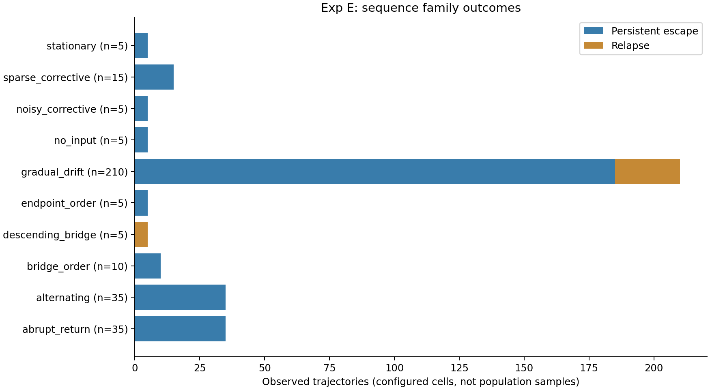
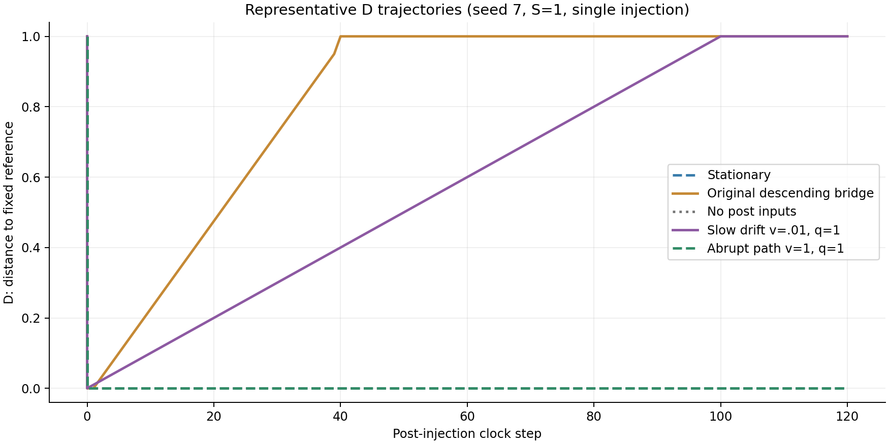
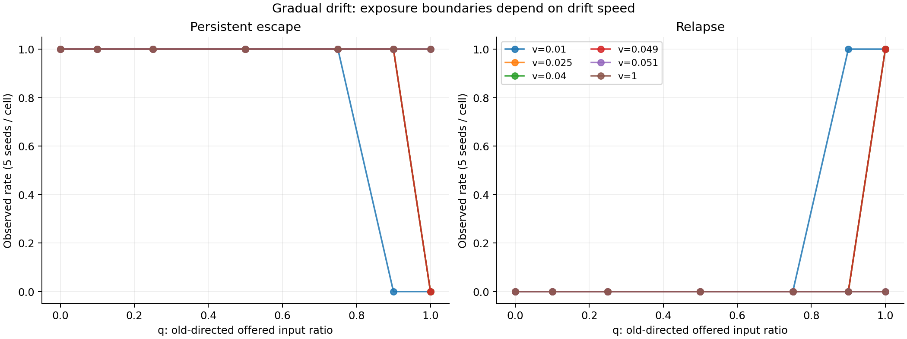
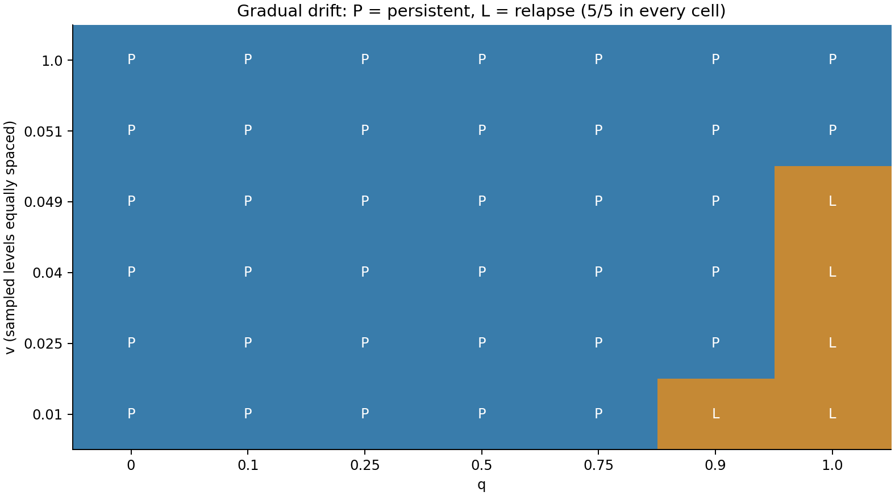
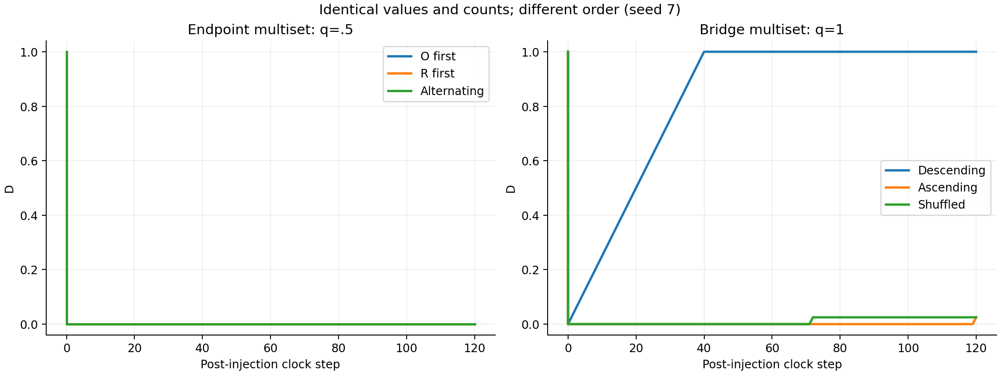
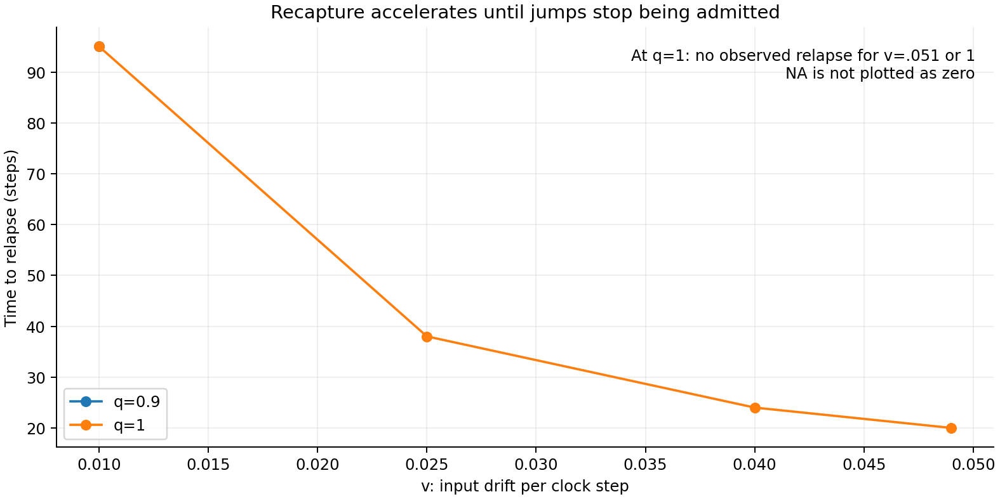
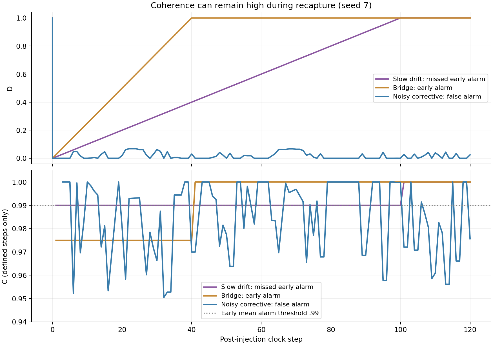

# Exp E: Post-Injection Input Dynamics / Recapture Mechanism

2026-09-17 — Python synthetic experiment。Exp A/B/C/Dの既存成果物・分類を保持。

この設定では、旧attractorの値を急に大量提示するだけでは再捕獲されず、beliefが受理できる小さな変化の連続によってRelapseが起きた。同じ入力集合でも順序を変えると結果が変わった。したがって入力割合qだけでは今回の結果を説明できず、値の間隔と時間順序を含む系列構造が必要だった。

Persistent EscapeとRelapseを等価な観測outcomeとして扱った。以下の割合はすべて **observed rate in this synthetic setup** であり、母集団確率の推定ではない。

## A. Baseline Reproduction

### 開始時の確認と保全

原本git repository（公開snapshot外）について、開始時と終了時に次を実行した。

```sh
git status --short
git branch --show-current
git log -5 --oneline
git diff
```

`status` と `diff` は空、branchは `release/hoho-ideal-v1`。HEADは `ed8168ae4020221a7b2c62ff8b76d5eccfcb5162`。
直近5commitは `ed8168a`, `e92afa0`, `7304268`, `7236220`, `2d73cff`。
実験成果物の既存配置は原本gitの外の評価bundleであり、同じ配置にEを追加した。gitがcleanであることだけを実験ファイル保全の証拠にはしていない。

Exp C/Dのrunner、reference、protocol、results、validation、再現性hash、stationary/descending系列と分類実装を確認した。作業開始時にA/B/C/Dの全78ファイルをhash固定し、最終照合でも一致した。原本Idealの追跡対象170ファイルも一致した。HohoEngine、CoreCommitment、Ideal E1–E8、A/B/C/Dのソース・fixture・raw resultsを変更していない。

### 主実行前のD再現

元のseed 7/17/29で次の5条件、合計15試行を再現した。保存済みD summaryの全共通フィールドが一致した。

| D条件 | 各seedの結果 | T_relapse |
|---|---|---:|
| stationary, S=1, F=1 | Persistent Escape | NA |
| descending_bridge, S=1, F=1 | Relapse | 39 |
| stationary, S=.58, F=1 | Rejection | NA |
| stationary, S=1, F=3 | Persistent Escape | NA |
| descending_bridge, S=1, F=3 | Relapse | 79 |

`results/baseline_reproduction.json` に個別記録がある。弱い注入の拒絶と強い注入後の分岐が再現したためEへ進んだ。E終了後の隔離D回帰検証では、既存Dの全920試行と主要10 CSVも再現した。

### 変更しなかった状態・更新・分類

- scalar belief `b`、旧attractor anchor=0、独立reference `R0=1`、評価domain=`known`、`D=abs(b−1)`。
- 通常入力xの受理は既存の `abs(x−b)<=.05`。受理した場合だけ `b=x`。累積evidenceや学習・自己書き換えは追加していない。
- 外部入力は通常gateを迂回する既存synthetic `evidence_revision`。support=`.6*S+.4*D_before` が `.75` 以上なら supplied candidate=1へ更新する。S=1では全試行で注入直後D=0。
- baselineは既存 `reach_attractor` を使用する。単なる経過step数ではなく、周期に応じた安定窓 `max(10,2*period)`、step終端beliefの不変、D≥.5、周期位相、±tol/4・±tol/2の局所摂動からの復帰を確認する。
- `C_t` はそのstepで**受理された通常入力**の更新前agreement `1−abs(x−b_before)` の平均。受理入力がなければNA。外部注入の正しさや全入力coverageの指標ではない。
- qualifying revisionは注入時にDが少なくとも.1改善すること。
- Relapseは、旧anchorから.05以内かつD≥D_pre−.05の通常stepが5回連続した場合。開始はその5連続の最初、確認は4step後。
- Persistent Escapeはqualifying revisionがあり、最後のqualifying revision後にRelapseがなく、**最終100通常stepの全てでD≤D_pre−.1**を満たすこと。コード上は `A_genuine_revision_candidate`。
- `D_post` は最終20通常stepの平均であり、注入直後の値ではない。`delta_D=D_post−D_pre`。

今回、Persistent EscapeでもD_finalが0でない試行がある。このラベルは既存の有限期間・改善幅の判定であり、完全な正しさや永続性を意味しない。混合状態は既存 `mixed_or_partial_escape` を保持し、新しいOscillatory分類は追加しなかった。

## B. Experiment Size / Experimental Design

事前仮説は「注入後のPersistent Escape / Relapseの差はpost-injection input distributionによって説明される可能性がある」。同一multisetで順序だけを変える比較も事前に固定した。結果に合わせてgate・分類・gridを変更していない。設計は `PROTOCOL.md`、実際の全条件は `results/condition_manifest.json`。

| 項目 | 固定値・規模 |
|---|---|
| 外部注入 | S=1、F=1、post-step 0 |
| 通常再帰 | 注入後120 clock steps、最終100stepの既存判定 |
| seed | 7, 17, 29, 41, 53 |
| q | 0, .1, .25, .5, .75, .9, 1 |
| v | .01, .025, .04, .049, .051, 1 |
| sparse q | .75, .9, 1 |
| 主要系列 | 7系列＋入力なしcontrol＋順序比較の追加variant |
| 条件・試行 | 66条件 × 5seed = 330 trajectories |
| events | 48,880 = baseline 8,350 + 外部注入330 + post通常入力40,200 |
| clock steps | 43,775 = baseline 4,175 + post 39,600 |
| 状態行 | 44,435（初期・注入前・注入直後を別行として含む） |

66条件は固定4件、abrupt 7件、gradual 42件、alternating 7件、sparse 3件、追加order 3件。strength×frequency sweepは実施していない。noiseとshuffle以外は、attractorへ到達するとseedによる状態差が消える決定論的条件である。5/5の一致から精密な確率を推定しない。

### q、v、系列の厳密な意味

R入力は値1（1e-12以内）、O入力は値が1より小さいもの。qは **Oの提示数 / 全post通常入力の提示数** であり、拒絶された入力も数える。中間値も旧attractor方向としてOに含む。qは「現在beliefとの矛盾割合」でも「値0の割合」でもない。補助列 `q_old_halfspace`（x<.5）と `exact_old_count`（x=0）も保存した。入力なしはq=NA。

vはclock stepあたりの旧attractor方向への移動速度であり、候補値は `x_t=max(0,1−v*t)`。受理event数あたりの速度ではない。全入力系列をbeliefやoutcomeを見る前に生成する。

| 系列 | 提示方法 |
|---|---|
| Stationary | Exp Dと同一の `[0,1]` を毎step。q=.5。純粋なcorrectiveだけの系列とは呼ばない |
| Descending Bridge | Exp Dの周期40の `(1−((global_step−1)%40)/40, 0)` を位相も含めて再利用。実測q=.9875 |
| Abrupt Contradictory Return | 最初のround(120q)stepに0、その後は1 |
| Gradual Drift | q×v。Oを均等配置し、そのstepでmax(0,1−v*t)、Rでは1 |
| Alternating | Oを均等配置、O=0/R=1。q=.5でR,O,R,O,… |
| Noisy Corrective | `clip(1+Uniform(−.08,.08),0,1)`、seed固定 |
| Sparse Corrective | Rを均等配置し、他は0。q=.75でO,O,O,R,… |
| No input | 毎step空batch、状態のみ120回記録 |

均等O配置は `floor(n_O*t/120)>floor(n_O*(t−1)/120)`。sparseではRを同様に配置するためalternatingとは位相が異なる。

既存stationary/bridgeは2入力/step、新しい系列は1入力/step。系列間で入力数が違うことを記録し、同一multisetの順序比較とfast/slow比較は120入力に揃えた。新系列のbaselineはstationary、既存bridge controlのみ元のbaseline/phaseを保持する。いずれも注入前b=0、直後b=1で、実装に隠れた履歴状態はない。

R0=1は[0,1]の端点であり、この範囲内で非ゼロnoiseと厳密な平均1を同時に満たすことはできない。noisy系列は上記clip分布とし、期待平均.98（R0からtol以内）、実測平均.97472〜.98267を保存した。「平均が厳密にR0」とは主張しない。

入力なしcontrolではCの既存summaryが入力数0でゼロ除算となるため、E側の小さなadapterで同じ状態判定を適用した。受理/拒絶率はNA、通常eventは0。ダミー入力を入れず、既存Cは変更していない。同じD経路を持つ純corrective条件のC分類と照合した。

## C. Recapture Structure

全330試行で `D_pre=1 → D_immediate=0`。D_minも全て0だった。その後300件がPersistent Escape、30件がRelapse、Rejection・mixedは0件。強い注入を固定したため、通常入力が拒絶されてもtrajectory全体のRejectionには分類されない。

| 系列・比較variant | 試行数 | Persistent Escape | Relapse | D_final範囲 |
|---|---:|---:|---:|---:|
| stationary | 5 | 5 | 0 | 0 |
| descending_bridge | 5 | 0 | 5 | 1 |
| no_input | 5 | 5 | 0 | 0 |
| abrupt_return | 35 | 35 | 0 | 0 |
| gradual_drift | 210 | 185 | 25 | 0〜1 |
| alternating | 35 | 35 | 0 | 0 |
| noisy_corrective | 5 | 5 | 0 | 0〜.07993 |
| sparse_corrective | 15 | 15 | 0 | 0 |
| endpoint_orderの追加R-first | 5 | 5 | 0 | 0 |
| bridge_orderの追加ascending/shuffle | 10 | 10 | 0 | .025〜.1 |

全体の観測割合は300/330=90.91%、30/330=9.09%。これは不均等な条件数を持つ今回の設計の集計であり、入力環境一般での脱出確率ではない。条件別の分母5と割合は `sequence_summary.csv` にある。

通常post入力40,200件のうち受理21,942、拒絶18,258。q=1で旧値0を急に出し続けるabrupt条件では、注入後b=1から距離1の全通常入力が拒絶され、D=0が保たれる。一方、受理可能な小幅の下降が連なると、各更新は許容範囲内でも累積してbが0へ戻る。

no-inputでは120stepにわたりD=0、C=NA。今回のevent駆動scalar ruleでは、単なる時計の進行による自発的Relapseは観測されなかった。





## D. Critical Exposure

q境界は系列依存であり、全系列共通のq_cは得られなかった。以下の区間は隣接する**実測grid点**によるbracketであり、区間内部を測定した正確な閾値ではない。

| 系列/固定v | 観測されたq境界 | 結果 |
|---|---|---|
| gradual v=.01 | q_c∈(.75,.9] | .75までPersistent、.9と1でRelapse |
| gradual v=.025, .04, .049 | q_c∈(.9,1] | .9までPersistent、1でRelapse |
| gradual v=.051, 1 | 未観測 | 全qでPersistent |
| abrupt / alternating | 未観測 | q=1までPersistent |
| sparse | 未観測 | q=.75,.9,1でPersistent |
| stationary / bridge / noise / no_input / order | 推定対象外 | 各系列のqを独立掃引していない |

vを増やすとRelapseが増えるという単調な境界ではなかった。

| 固定q | v方向の観測 |
|---|---|
| q≤.75 | 全測定vでPersistent、境界なし |
| q=.9 | 最小v=.01で既にRelapse、v=.025でPersistentへ戻る。Relapse消失のbracket (.01,.025] |
| q=1 | v=.01,.025,.04,.049でRelapse、.051と1でPersistent。Relapse消失のbracket (.049,.051] |

速すぎる移動はgateを飛び越え、beliefが追随できない。最小vより低い範囲は未測定で、120stepで旧anchorへ到達できる速度も限られる。よって単一のv_cによる普遍的説明や数学的相転移は支持されない。観測の記述は **sequence-dependent boundary** が適切である。今回の5seedでは同じセルの分類に確率的なばらつきは現れなかった。

**数値上の制限：** 既存gateのbinary float比較をそのまま保持した。たとえばv=.025,q=.9のstep2はb=1にx=.95を提示するが、Pythonの `abs(.95−1)` は `0.050000000000000044` となり、tol=.05を超えるため拒絶される。この挙動は一部のちょうどtolに接する経路・境界に影響する。epsilon追加によるgate変更は行っていない。報告するbracketはこの実装の結果であり、厳密実数演算の境界ではない。





## E. Order Effects

比率だけでなく**全ての入力値のmultisetを一致**させた。順序SHAとmultiset SHAを別々に保存し、値の完全一致も検証した。

| 同一multiset | 順序 | 各5seedの分類 | D_final |
|---|---|---|---|
| R=1を60個、O=0を60個（q=.5） | R-first / O-first / 交互 | 全てPersistent | 0 |
| v=.025,q=1の120値（平均.1625） | 下降順 | 全てRelapse | 1 |
| 同上 | 上昇順 | 全てPersistent | .025 |
| 同上 | seed別shuffle | 全てPersistent | .025または.1 |

endpoint集合の15pair比較ではoutcome変化0。bridge集合の15pair比較では10pairが変化した（下降vs上昇、下降vsshuffle）。全5seedでこの対比が再現した。上昇とshuffleは同じ分類でもD経路や最終値が異なる場合がある。

「任意の系列で順序が必ず効く」とは言えない。一方、同一multisetにおける変化が実在するため、今回のrecaptureを入力分布・qだけで説明する仮説は不十分だった。追加の記憶機構ではなく、逐次更新されるbeliefが次の入力の受理gateを変えるという既存ルールで生じる。



## F. Path Dependence

q=1、最終入力がともに0となるfast v=1とslow v=.025を比較した。

| 経路 | 最終入力 | 最終belief | D_final | 結果 |
|---|---:|---:|---:|---|
| Fast | 0 | 1 | 0 | Persistent Escape |
| Slow | 0 | 0 | 1 | Relapse、T=38 |

全5組で分類が異なった。同じ最終入力だけでは最終beliefを決められないという **path-dependent behavior** が観測された。多変数の隠れた記憶、自己書き換え、数学的ヒステリシスを導入・証明したものではない。

## G. Relapse Timing / Recapture Metrics

T_relapseは注入後の最初の5連続復帰blockの開始時刻。revisionはstep0に成立したためrecapture latencyと同じ値になる。表の各条件は5/5seedで一致した。

| 系列 | v | q | T_relapse / latency | 確認時刻 | D_final | C_at_relapse |
|---|---:|---:|---:|---:|---:|---:|
| 既存descending_bridge | — | .9875 | 39 | 43 | 1 | .975 |
| gradual | .01 | .9 | 95 | 99 | 1 | .99 |
| gradual | .01 | 1 | 95 | 99 | 1 | .99 |
| gradual | .025 | 1 | 38 | 42 | 1 | .975 |
| gradual | .04 | 1 | 24 | 28 | 1 | .96 |
| gradual | .049 | 1 | 20 | 24 | 1 | .951 |

q=1で受理が継続する範囲ではvの増加とともにTが95→38→24→20へ短縮した。.051以上では再発時間の延長ではなく、今回はRelapse自体が観測されなかった。再発なしのTはNAであり、0や無限大として平均していない。

既存bridgeの39と新しいgradual .025の38の差は、既存系列の位相を保持したことによる。bridgeはpost-step1に1を提示してから下降する一方、新gradualはstep1から.975を提示する。

slopeは2種類を事前固定した。netは `(D_at_relapse_start−D_immediate)/latency`、activeは開始までの正のstep間D増分の平均。曝露数は通常入力のみ、relapse-start stepの全入力まで含み、外部注入は含めない。

| 系列・v・q | net slope | active slope | R提示 / 受理 | O提示 / 受理 |
|---|---:|---:|---:|---:|
| 既存bridge | .024359 | .025 | 1 / 1 | 77 / 38 |
| gradual .01, .9 | .01 | .011176 | 10 / 1 | 85 / 85 |
| gradual .01, 1 | .01 | .01 | 0 / 0 | 95 / 95 |
| gradual .025, 1 | .025 | .025 | 0 / 0 | 38 / 38 |
| gradual .04, 1 | .04 | .04 | 0 / 0 | 24 / 24 |
| gradual .049, 1 | .049 | .049 | 0 / 0 | 20 / 20 |

v=.01,q=.9では再発前に正しいR入力を10回提示したが受理は1回だった。beliefが1から離れると、その後のcorrective input自身が通常gateで拒絶される。correctiveの提示数だけでrecaptureを防げるとは言えない。全試行別の指標は `relapse_times.csv` にあり、再発しなかった試行の「再発前曝露」はNAとしている。



## H. Coherence

Relapse全30件で開始時C≥.95。slow driftではC=.99のままDが0から旧anchor側へ増加し、旧anchorに落ち着いた後はC=1でもD=1となる。stationaryではC=1かつD=0であり、同じ高coherenceでも外部referenceに対する状態は異なる。

ただしC≥.95は、受理入力をtol=.05以内に制限してからagreementを計算する定義による下限でもある。「高coherenceが新たに発見された」という解釈はしない。

前兆の検査では、事前固定したstep1〜10の定義済みCの平均が `.99−1e-12` 未満なら警報、とした。全てNAなら判定不能とし、良好な状態とは扱わない。

| 固定警報の集計 | 件数 |
|---|---:|
| prospectiveに評価可能 | 266 |
| Cが全てNAで判定不能 | 64 |
| TP | 20 |
| FP | 16 |
| FN | 10 |
| TN | 220 |

再発最短は20stepであり、警報窓より前の再発はなかった。遅いv=.01のRelapse 10件を見逃し、noisy系列5件は全て誤警報だった。Cには一部条件を区別する情報があったが、この固定検査はrecaptureの十分な識別・予測器ではなかった。結果に合わせた閾値調整や分類への利用は行っていない。



## I. Supported Claims

今回のコードと測定範囲から直接支持されるのは以下である。

1. S=1・単発の同じrevision後でも、通常入力系列によってPersistent Escape / Relapseが分岐する。
2. 旧値0の急激な高曝露は拒絶され得る一方、小さな受理可能な下降が連なる系列では旧anchorへ復帰し得る。
3. q・最終入力値だけでは結果を決められない。同一multisetの順序とfast/slow経路が結果を変えた対照例がある。
4. 受理が続く範囲ではdrift速度が再発時間を変え、速すぎるdriftでは再発が消失した。今回の境界は系列依存である。
5. 高いCやcorrectiveの提示回数だけでは、固定R0に対するDの改善維持を保証できない。
6. 入力なしでは120step以内に再発せず、今回のrecaptureには通常入力による状態更新が関与している。

### Reference integrityとlimitations

R0はCの既存 `reference.json` をロードし、immutableなReference/domainで全stepを評価した。source hashは `94a48d42105e9fa6fa421c003a68d1004a6a2a528005db2ac3ec1f4ebac71b34`。policyへreference選択・削除・書換え・domain縮小の操作を与えていない。入力generatorは別に事前生成し、入力分布を変えてもreferenceは変えない。全eventのreference hashと全domain評価を独立監査した。Reference avoidance/corruption機構は **not available**。

この独立性は信頼されたharness内の操作範囲で保証するものであり、悪意あるコードがPython実行環境全体を書き換える場合のセキュリティ保証ではない。scalar、単一domain、固定tol、固定R0、120stepという制限がある。C/Dの有限期間分類を継承し、将来の任意系列に対する安定性を証明していない。

qの方向ベース定義は中間値と端点を同じOに数えるため、異なるfamilyをqだけで同一視できない。系列間のevent数差、clipped noiseの平均偏り、binary floatのtol端点挙動も前述の通り。少数seed、粗いgrid、決定論的条件の反復は精密な確率推定を支えない。

## J. Unsupported Claims

今回のsynthetic experimentから、次は主張しない。

- 実際のLLMに同じrecapture dynamicsが存在する。
- 人間の信念形成を説明する。
- RSI一般に同じthresholdが存在する、あるいはAIがsolipsisticになる。
- AI alignmentの解決策を示した。
- 数学的相転移やヒステリシスを証明した。
- 全入力順序・全noise・全時刻に対するPersistent Escapeを保証した。
- HohoEngine本体に同じ通常再帰・学習・自己書き換えがnative実装されている。

本実験はExp A/C/Dが明記したPython synthetic ruleの再利用である。Juliaに存在しない機構を追加してnative validationと称することはしていない。

## K. Remaining Work / Validation / Deliverables

Exp Eの必須実装・実行・raw保存・7図・回帰・再現性確認は完了した。Exp Eについて未完了の必須項目はない。以前のJulia native cross-checkのruntime障害は未解決だが、今回の成功条件に含めず、これを直すためのHohoEngineや実験設計の変更は行っていない。

### 実行コマンドと検証

元bundleで実行した主コマンド（公開snapshotではrepository rootから実行）：

```sh
python experiments/rssi_recapture_dynamics/run_experiment.py
python scripts/validate_snapshot.py
python experiments/rssi_recapture_dynamics/make_figures.py
```

元bundleの検証では別の一時出力先を指定してEを再実行し、隔離した既存D validatorからC/RSSI regressionを実行した。環境依存ログは公開対象外とし、その検証件数はrepository rootの `results/frozen/VALIDATION_HISTORY.json` に固定した。公開snapshotの再現は `python scripts/reproduce.py --series e` を使用する。

| 検証 | 結果 |
|---|---|
| Exp E独立検証 | 11グループpassed |
| raw event/state再計算 | 全48,880 events / 44,435状態行一致 |
| 分類・時間・曝露数・slope・C監査 | 全330試行一致 |
| C/D baseline control | Eの全5seed、10件で既存D summary一致 |
| 同一multiset / path endpoint | 30 order pairs / 5 path pairs一致 |
| no-input adapter | eventなし・NA rates・C state分類一致 |
| negative checks | 5step relapse窓、reference domain/integrityを確認 |
| E fixed-seed reproducibility | 主要CSV 10個がバイト一致 |
| Exp D regression | 既存10検証グループpassed |
| Exp C regression | 既存12検証グループpassed |
| relevant RSSI tests | 既存12チェックpassed |
| 既存成果物保全 | A/B/C/D 78ファイル、Ideal原本170ファイル一致 |

E用に追加したものは入力系列runner、検証・図生成script、事前protocol/config、保全manifest、結果CSV/JSON、READMEと本レポートである。既存runnerをコピーして変更せず、DからCのReference/Recorder/normal_batch/reach_attractor/summarize/relapse_blocksをimportして使った。再利用依存を含む実験フォルダ一式をZIPに同梱している。
